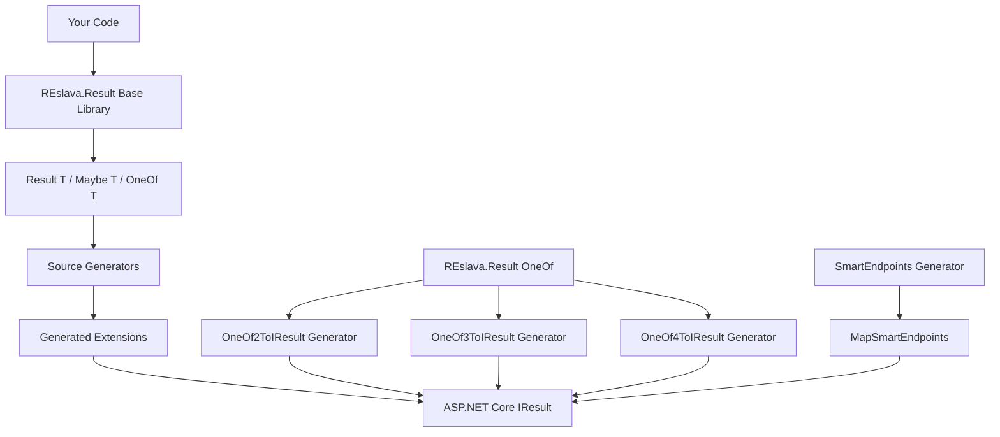

# REslava.Result - Railway-Oriented Programming for .NET

<div align="center">
                  
[](https://reslava.github.io/nuget-package-reslava-result/)
[](https://reslava.github.io/nuget-package-reslava-result/reference/api/index.html)


[](https://GitHub.com/reslava/REslava.Result/graphs/contributors/) 
[](https://github.com/reslava/REslava.Result/stargazers) 
[](https://www.nuget.org/packages/REslava.Result)


</div>

**📐 Complete Functional Programming Framework + ASP.NET Integration + OneOf Extensions**

**📖 Comprehensive documentation is available at [reslava.github.io/nuget-package-reslava-result](https://reslava.github.io/nuget-package-reslava-result/)**
Includes API reference, advanced patterns, and interactive examples.

### Why REslava.Result?

> **The only .NET library that combines functional error handling with compile-time ASP.NET API generation.**

| | REslava.Result | FluentResults | ErrorOr | LanguageExt |
|---|:---:|:---:|:---:|:---:|
| Result&lt;T&gt; pattern | ✅ | ✅ | ✅ | ✅ |
| OneOf discriminated unions | ✅ (2-6 types) | — | — | ✅ |
| Maybe&lt;T&gt; | ✅ | — | — | ✅ |
| **ASP.NET source generators (Minimal API + MVC)** | **✅** | — | — | — |
| **SmartEndpoints (zero-boilerplate APIs)** | **✅** | — | — | — |
| **OpenAPI metadata auto-generation** | **✅** | — | — | — |
| **Authorization & Policy support** | **✅** | — | — | — |
| **Roslyn safety analyzers** | **✅** | — | — | — |
| **JSON serialization (System.Text.Json)** | **✅** | — | — | — |
| **Async patterns (WhenAll, Retry, Timeout)** | **✅** | — | — | — |
| **Domain error hierarchy (NotFound, Validation, etc.)** | **✅** | — | Partial | — |
| Validation framework | ✅ | Basic | — | ✅ |
| Zero dependencies | ✅ | ✅ | ✅ | — |

**Unique advantage**: SmartEndpoints auto-generates complete Minimal API endpoints from your business logic — including routing, DI, HTTP status mapping, error handling, full OpenAPI metadata (`.Produces<T>()`, `.WithSummary()`, `.WithTags()`), and authorization (`.RequireAuthorization()`, `.AllowAnonymous()`). No other .NET library does this.

---

## 📚 Table of Contents

**🚀 Getting Started**
- [📦 Installation](#-installation) — NuGet setup, supported TFMs, prerequisites
- [🚀 Quick Start](#-quick-start) — Zero-boilerplate generator showcase
- [🧪 Quick Start Scenarios](#-quick-start-scenarios) — Hands-on tutorials
- [📚 Choose Your Path](#-choose-your-path) — Find exactly what you need
- [🎯 The Transformation](#-the-transformation-70-90-less-code) — 70-90% less boilerplate

**📘 Core Concepts**
- [📐 REslava.Result Core Library](#-reslavaresult-core-library) — Result<T>, composition, async, LINQ, OkIf/FailIf, Try/TryAsync
- [⚠️ Error Types](#️-error-types) — Domain errors, custom CRTP errors, rich tag context
- [✅ Validation Rules](#-validation-rules) — Declarative rule-based validation
- [🏷️ Validation Attributes](#️-validation-attributes) — `[Validate]` source generator
- [🎲 Maybe\<T>](#-maybe) — Safe null handling with optionals
- [🔀 OneOf Unions](#-oneof-unions) — Discriminated unions with exhaustive matching
- [🧠 Advanced Patterns](#-advanced-patterns) — Functional composition, performance

**🌐 ASP.NET Integration**
- [🚀 SmartEndpoints](#-smartendpoints) — Zero-boilerplate Minimal APIs with auth, filters, caching
- [🔀 OneOf to IResult](#-oneof-to-iresult) — HTTP mapping for discriminated unions
- [🚀 ASP.NET Integration](#-aspnet-integration) — ToIResult, ToActionResult, Problem Details, MVC

**🏛️ Architecture & Design**
- [📐 Complete Architecture](#-complete-architecture) — How generators work internally
- [📦 Package Structure](#-package-structure) — What you get with each package
- [🔧 How Generators Work](#-how-generators-work) — Two-phase source generator pipeline

**💻 Code Examples**
- [🎯 Quick Examples](#-quick-examples) — Real-world code samples

**🧪 Testing & Quality**
- [🧪 Testing & Quality Assurance](#-testing--quality-assurance) — 3,339 tests, CI/CD pipeline
- [🛡️ Safety Analyzers](#️-safety-analyzers) — RESL1001–RESL1006 + RESL2001, 7 diagnostics + 3 code fixes
- [📈 Production Benefits](#-production-benefits) — Enterprise-ready advantages
- [🌍 Real-World Impact](#-real-world-impact) — Success stories and use cases
- [🏆 Why Choose REslava.Result?](#-why-choose-reslavaresult) — Unique advantages

**📖 Reference**
- [📖 API Documentation](docs/api/Overview.md) — Namespace overview and type reference
- [📚 API Reference](https://reslava.github.io/nuget-package-reslava-result/reference/api/index.html) — Complete DocFX API reference — all public types, members, and XML docs
- [🎯 Roadmap](#-roadmap) — Future development plans
- [📈 Version History](#-version-history) — Release notes and changes

**🤝 Community**
- [🤝 Contributing](#-contributing) — How to contribute
- [📄 License](#-license) — MIT License details
- [🙏 Acknowledgments](#-acknowledgments) — Community credits
- [Contributors](#contributors) — Project contributors

---

## 📦 Installation

### NuGet CLI

```bash
dotnet add package REslava.Result                      # Core library — Result<T>, errors, functional composition
dotnet add package REslava.Result.SourceGenerators     # Source generators — SmartEndpoints, [Validate], OneOfToIResult
dotnet add package REslava.Result.Analyzers            # Roslyn analyzers — catch unsafe .Value access at compile time

# ⚠️ OPTIONAL — migration bridge only. NOT needed for new projects.
# REslava.Result already includes full validation via [Validate] + Validation DSL.
# Only install if your team already uses FluentValidation and wants to keep existing validators.
dotnet add package REslava.Result.FluentValidation
```

### PackageReference (csproj)

```xml
<ItemGroup>
  <PackageReference Include="REslava.Result" Version="1.30.0" />
  <PackageReference Include="REslava.Result.SourceGenerators" Version="1.30.0" />
  <PackageReference Include="REslava.Result.Analyzers" Version="1.30.0" />

  <!--
    OPTIONAL — migration bridge. NOT needed for new projects.
    REslava.Result already includes equivalent validation via [Validate] + Validation DSL.
    Only add this if your team has existing FluentValidation validators you want to keep.
  -->
  <PackageReference Include="REslava.Result.FluentValidation" Version="1.30.0" />
</ItemGroup>
```

### Supported Frameworks

| Package | Target Frameworks |
|---------|------------------|
| `REslava.Result` | .NET 8, .NET 9, .NET 10 |
| `REslava.Result.SourceGenerators` | .NET Standard 2.0 (generates code for any TFM) |
| `REslava.Result.Analyzers` | .NET Standard 2.0 |
| `REslava.Result.FluentValidation` ⚠️ **Optional** | .NET Standard 2.0 (generator-only, no runtime) — migration bridge only |

### Prerequisites

- **.NET 8 SDK or later** — required for the core library
- **C# 12 or later** — recommended (required for some generator patterns)
- **Visual Studio 2022 17.8+**, **VS Code with C# Dev Kit**, or **JetBrains Rider**

---

## 🚀 Quick Start

See [📦 Installation](#-installation) for NuGet setup.

Decorate a controller class — the source generator builds complete Minimal API endpoints automatically:

```csharp
[AutoGenerateEndpoints(RoutePrefix = "/api/users")]
public class UserController
{
    private readonly UserService _service;
    public UserController(UserService service) => _service = service;

    public async Task<OneOf<ValidationError, NotFoundError, User>>
        GetUser(int id) => await _service.GetUserByIdAsync(id);

    public async Task<OneOf<ValidationError, ConflictError, User>>
        CreateUser(CreateUserRequest request) => await _service.CreateAsync(request);

    public async Task<Result<List<User>>> GetUsers() => await _service.GetAllAsync();
}
```

**Generated automatically — zero manual code:**
- `GET /api/users/{id}` → 200 / 400 / 404 (HTTP status from `OneOf` error types)
- `POST /api/users` → 201 / 400 / 409
- `GET /api/users` → 200
- Full OpenAPI metadata — `.Produces<T>()`, `.WithSummary()`, `.WithTags()`, `.WithName()`

For complete feature documentation see [🚀 SmartEndpoints](#-smartendpoints), [🌐 ASP.NET Integration](#-aspnet-integration), and the sections below.

---

## 🧪 Quick Start Scenarios

See [📦 Installation](#-installation) for NuGet setup.

### Scenario 1: Functional Programming Foundation
```csharp
using REslava.Result;
using static REslava.Result.Functions;

// Core Result pattern usage
public Result<User> GetUser(int id)
{
    if (id <= 0) 
        return Result<User>.Fail("Invalid user ID");
    
    var user = FindUser(id);
    return user ?? Result<User>.Fail($"User {id} not found");
}

// Functional composition
public Result<UserDto> GetUserDto(int id) =>
    GetUser(id)
        .Map(ToDto)
        .Tap(LogAccess)
        .Ensure(dto => dto.IsActive, "User is inactive");

// LINQ integration
public Result<UserDto> GetUserDtoLinq(int id) =>
    from user in GetUser(id)
    from validation in ValidateUser(user)
    from dto in ToDto(user)
    select dto;
```

### Scenario 2: ASP.NET Integration
```csharp
[ApiController]
public class UsersController : ControllerBase
{
    // Automatic HTTP mapping
    [HttpGet("{id}")]
    public IResult GetUser(int id) => 
        GetUser(id).ToIResult(); // 200 OK or 404/400
    
    // POST with created response
    [HttpPost]
    public IResult CreateUser([FromBody] CreateUserRequest request) =>
        CreateUser(request).ToPostResult(); // 201 Created or 400
}
```

### Scenario 3: OneOf Extensions (NEW!)
```csharp
using REslava.Result.AdvancedPatterns.OneOf;
using Generated.OneOfExtensions;

// REslava.Result internal OneOf with automatic mapping
public OneOf<ValidationError, NotFoundError, User> GetUser(int id)
{
    if (id <= 0) 
        return new ValidationError("Invalid ID");
    
    var user = FindUser(id);
    return user ?? new NotFoundError($"User {id} not found");
}

[HttpGet("{id}")]
public IResult GetUser(int id) => 
    GetUser(id).ToIResult(); // 400, 404, or 200
```

---

## 📚 Choose Your Path

**Find exactly what you need based on your goals:**

| 🎯 **I'm building a...** | 📖 **Start Here** | 🚀 **What You'll Learn** |
|--------------------------|-------------------|---------------------------|
| **Web API** | [🌐 ASP.NET Integration](#-aspnet-integration) | Auto-conversion, error mapping, OneOf extensions |
| **Library/Service** | [📐 Core Library](#-reslavaresult-core-library) | Result pattern, validation, functional programming |
| **Custom Generator** | [⚙️ How Generators Work](#-how-generators-work) | Build your own source generators |
| **Advanced App** | [🧠 Advanced Patterns](#-advanced-patterns) | Maybe, OneOf, validation rules |
| **Testing** | [🧪 Testing & Quality](#-testing--quality-assurance) | 2,862+ tests, CI/CD, test strategies |
| **Curious About Magic** | [📐 Complete Architecture](#-complete-architecture) | How generators work, SOLID design |

---

## 🎯 The Transformation: 70-90% Less Code

**See how REslava.Result eliminates boilerplate in real .NET 10 applications:**

### ❌ BEFORE: Traditional Minimal API
```csharp
// Manual error handling, validation, and HTTP responses
app.MapPost("/users", async (CreateUserRequest request, IUserService service) =>
{
    // Manual validation
    if (string.IsNullOrWhiteSpace(request.Email))
        return Results.BadRequest(new { error = "Email required" });
    
    if (!IsValidEmail(request.Email))
        return Results.BadRequest(new { error = "Invalid email" });
        
    // Manual duplicate checking
    if (await EmailExistsAsync(request.Email))
        return Results.Conflict(new { error = "Email already exists" });
        
    try
    {
        var user = await service.CreateUserAsync(request);
        return Results.Created($"/users/{user.Id}", user);
    }
    catch (ValidationException ex)
    {
        return Results.BadRequest(new { errors = ex.Errors });
    }
    catch (Exception ex)
    {
        return Results.Problem("Internal server error");
    }
});
```

### ✅ AFTER: REslava.Result Magic
```csharp
// Clean, declarative, type-safe - 3 lines instead of 25+
app.MapPost("/users", async (CreateUserRequest request) => 
    await CreateUser(request));

// Service layer handles everything elegantly
public async Task<Result<User>> CreateUser(CreateUserRequest request) =>
    await Result<CreateUserRequest>.Ok(request)
        .Ensure(r => !string.IsNullOrWhiteSpace(r.Email), "Email required")
        .Ensure(r => IsValidEmail(r.Email), "Invalid email format")
        .EnsureAsync(async r => !await EmailExistsAsync(r.Email), "Email already exists")
        .BindAsync(async r => await _userService.CreateUserAsync(r))
        .WithSuccess("User created successfully");
```

**🚀 Result: 70-90% less code, 100% type-safe, automatic HTTP responses, rich error context!**

---

## 📐 REslava.Result Core Library

### 💡 Why Result Instead of Exceptions?

| | ❌ Exceptions | ✅ Result Pattern |
|--|---|---|
| **Visibility** | Hidden in method signatures | Explicit in return type |
| **Surprises** | Runtime surprises | Compile-time guarantees |
| **Code** | Complex try-catch blocks | Simple pattern matching |
| **Testing** | Hard to test error paths | Easy to test both paths |
| **Composition** | Break the call chain | Chain operations cleanly |

### 🧠 Functional Programming Foundation
**Railway-Oriented Programming (ROP)**
- **Immutable Results**: Thread-safe functional data structures
- **Error Composition**: Chain operations without exception handling
- **Success/Failure Pipelines**: Clean separation of happy and error paths
- **Type Safety**: Compile-time guarantees for error handling

### 🔧 Complete Method Catalog

#### **Core Operations**
```csharp
// Factory Methods
Result<T>.Ok(value)                    // Success result
Result<T>.Fail("error")                 // Failure result
Result.Fail("error")                    // Non-generic failure

// Pattern Matching
result.Match(
    onSuccess: value => DoSomething(value),
    onFailure: errors => HandleErrors(errors)
);

// Value Access
result.Value                            // Throws if failed
result.GetValueOrDefault(defaultValue)  // Safe access
```

#### **Functional Composition**
```csharp
// Bind (Chain operations)
var result = Result<int>.Ok(5)
    .Bind(x => Result<string>.Ok(x.ToString()))
    .Bind(s => ValidateEmail(s));

// Map (Transform success values)
var result = Result<int>.Ok(5)
    .Map(x => x * 2)
    .Map(x => x.ToString());

// Tap (Side effects without changing result)
var result = Result<User>.Ok(user)
    .Tap(u => LogUserAccess(u))
    .Tap(u => SendNotification(u));

// Ensure (Validation)
var result = Result<string>.Ok(email)
    .Ensure(e => IsValidEmail(e), "Invalid email format")
    .EnsureAsync(async e => !await EmailExistsAsync(e), "Email already registered");
```

#### **Async Operations**
```csharp
// All methods have async variants
var result = await Result<int>.Ok(id)
    .BindAsync(async i => await GetUserAsync(i))
    .MapAsync(async user => await ToDtoAsync(user))
    .TapAsync(async dto => await LogAccessAsync(dto))
    .EnsureAsync(async dto => await ValidateDtoAsync(dto), "Invalid DTO");
```

#### **Async Patterns (WhenAll, Retry, Timeout)**
```csharp
// Run multiple async results concurrently — typed tuples!
var result = await Result.WhenAll(GetUser(id), GetAccount(id));
var (user, account) = result.Value;

// Retry with exponential backoff
var result = await Result.Retry(
    () => CallExternalApi(),
    maxRetries: 3,
    delay: TimeSpan.FromSeconds(1),
    backoffFactor: 2.0);

// Enforce time limits
var result = await GetSlowData().Timeout(TimeSpan.FromSeconds(5));
```

### 📊 LINQ Integration
**Functional Query Comprehensions**
```csharp
// LINQ-like syntax for Result operations
var result = from user in GetUser(id)
            from validation in ValidateUser(user)
            from saved in SaveUser(validation)
            from notification in SendNotification(saved)
            select saved;

// Complex queries
var results = from id in userIds
             from user in GetUserAsync(id)
             from updated in UpdateUserAsync(user)
             select updated;

// Equivalent to method chaining
var result = GetUser(id)
    .Bind(ValidateUser)
    .Bind(SaveUser)
    .Bind(SendNotification);
```

### 🎯 Advanced Patterns

#### **Maybe<T> - Null-Safe Optionals**
```csharp
// Instead of null references
Maybe<User> user = GetUserFromCache(id);
var email = user
    .Select(u => u.Email)
    .Filter(email => email.Contains("@"))
    .ValueOrDefault("no-reply@example.com");

// Safe operations
var result = user
    .Map(u => u.Name)
    .Bind(name => ValidateName(name))
    .ToResult(() => new UserNotFoundError(id));
```

#### **OneOf - Discriminated Unions**
```csharp
// Internal OneOf implementation
OneOf<ValidationError, User> result = ValidateAndCreateUser(request);
return result.Match(
    case1: error => BadRequest(error),
    case2: user => Ok(user)
);

// Three-type OneOf
OneOf<ValidationError, NotFoundError, User> GetUser(int id) { /* logic */ }

// Conversion to Result
var result = oneOf.ToResult(); // Convert OneOf to Result
```

#### **Validation Rules Framework**
```csharp
// Built-in validation
var validator = Validator.Create<User>()
    .Rule(u => u.Email, email => email.Contains("@"))
    .Rule(u => u.Name, name => !string.IsNullOrWhiteSpace(name))
    .Rule(u => u.Age, age => age >= 18, "Must be 18 or older");

var result = validator.Validate(user);
```

#### **JSON Serialization (System.Text.Json)**
```csharp
using REslava.Result.Serialization;

// Register converters once
var options = new JsonSerializerOptions();
options.AddREslavaResultConverters();

// Result<T> serialization
var result = Result<User>.Ok(new User("Alice", "alice@test.com"));
var json = JsonSerializer.Serialize(result, options);
// {"isSuccess":true,"value":{"name":"Alice","email":"alice@test.com"},"errors":[],"successes":[]}

var deserialized = JsonSerializer.Deserialize<Result<User>>(json, options);

// OneOf<T1,T2> serialization
OneOf<Error, User> oneOf = OneOf<Error, User>.FromT2(user);
var json2 = JsonSerializer.Serialize(oneOf, options);
// {"index":1,"value":{"name":"Alice","email":"alice@test.com"}}

// Maybe<T> serialization
var maybe = Maybe<string>.Some("hello");
var json3 = JsonSerializer.Serialize(maybe, options);
// {"hasValue":true,"value":"hello"}
```

### 🔧 CRTP Pattern & Method Chaining
**Curiously Recurring Template Pattern**
```csharp
// Fluent method chaining with CRTP
var result = Result<User>.Ok(user)
    .Ensure(ValidateEmail)
    .Map(ToDto)
    .Tap(SendWelcomeEmail)
    .Bind(SaveToDatabase)
    .WithSuccess("User created successfully")
    .WithTag("UserId", user.Id);
```

### 🔄 Advanced Extensions
**Functional Composition**
```csharp
// Function composition
var createUser = Compose(
    ValidateRequest,
    MapToUser,
    SaveUser,
    SendNotification
);

// Higher-order functions
var results = users
    .Where(u => u.IsActive)
    .Select(u => ProcessUser(u))
    .Sequence(); // Turns IEnumerable<Result<T>> into Result<IEnumerable<T>>

// Traverse operations
var results = userIds
    .Traverse(id => GetUserAsync(id)); // Async version of Sequence
```

### 🚫 Tap on Failure — `TapOnFailure`

Execute a side-effect **only when the result has failed** — logging, metrics, alerting. The result passes through unchanged:

```csharp
Result<User> result = await GetUserAsync(id)
    .TapOnFailure(error => _logger.LogWarning("GetUser failed: {Msg}", error.Message));

// Async side-effect
Result<Order> order = await CreateOrderAsync(request)
    .TapOnFailureAsync(async error => await _metrics.IncrementAsync("order.failed"));

// Non-generic Result
Result operation = await DeleteUserAsync(id)
    .TapOnFailure(error => _audit.RecordFailure("delete_user", error));
```

Combine with `Tap()` for full success/failure observability in one chain:

```csharp
Result<Order> order = await CreateOrderAsync(request)
    .Tap(o => _logger.LogInformation("Order {Id} created", o.Id))
    .TapOnFailure(e => _logger.LogError("Order creation failed: {Msg}", e.Message));
```

### 🔀 Conditional Factories — `OkIf` / `FailIf`

Create results directly from boolean conditions — no if/else boilerplate:

```csharp
// Result (no value)
Result r1 = Result.OkIf(age >= 18, "Must be 18 or older");
Result r2 = Result.FailIf(user.IsSuspended, new ValidationError("Account suspended"));

// Result<T> — value on success
Result<User> r3 = Result<User>.OkIf(user != null, user!, "User not found");
Result<User> r4 = Result<User>.FailIf(user.Age < 18, new ValidationError("Age", "Must be 18+"), user);

// Lazy evaluation — condition and/or value computed only when needed
Result<User> r5 = Result<User>.OkIf(
    () => _db.IsUserActive(id),         // predicate evaluated lazily
    () => _db.LoadUser(id),             // value only loaded when needed
    "User not found");

// Async versions
Result result = await Result.OkIfAsync(() => _api.CheckExistsAsync(id), "Not found");
Result<User> result = await Result<User>.OkIfAsync(
    () => _api.CheckExistsAsync(id),
    () => _api.LoadUserAsync(id),
    "User not found");
```

### 🛡️ Exception Wrapping — `Try` / `TryAsync`

Safely execute code that may throw — exceptions become `ExceptionError` in a failed `Result<T>`:

```csharp
// Sync — wraps any thrown exception
Result<int> parsed = Result<int>.Try(() => int.Parse(input));
Result<User> user  = Result<User>.Try(() => GetUser(id));

// Custom error handler — map exception to a domain error
Result<User> result = Result<User>.Try(
    () => JsonSerializer.Deserialize<User>(json),
    ex => new ValidationError("body", $"Invalid JSON: {ex.Message}"));

// Async
Result<User> result = await Result<User>.TryAsync(
    async () => await _api.FetchUserAsync(id));

// Async with custom handler
Result<User> result = await Result<User>.TryAsync(
    async () => await _repo.GetAsync(id),
    ex => new NotFoundError($"User {id} not found"));
```

### ⏳ CancellationToken Support

All `*Async` methods accept `CancellationToken cancellationToken = default`:

```csharp
// Pass through from your endpoint/controller
Result<User> result = await Result<User>.TryAsync(
    async () => await _repo.GetAsync(id),
    cancellationToken: ct);

// Bind / Map / Tap async chains also accept ct
Result<UserDto> dto = await result
    .BindAsync(u => _mapper.MapAsync(u, ct))
    .TapAsync(d => _cache.SetAsync(d, ct));
```

### ✅ Best Practices

**Do:**
- Use `Result<T>` for expected business failures (validation, not found, conflict)
- Create custom error types for your domain (`OrderNotFoundError`, `InsufficientStockError`)
- Use tags to add structured context: `.WithTag("OrderId", id).WithTag("StatusCode", 422)`
- Chain operations with `Bind` for sequential steps; `Map` for transforms only
- Test both success and failure paths in unit tests

**Avoid:**
- Using `Result<T>` for truly unexpected/exceptional cases — those still warrant exceptions
- Accessing `.Value` without checking `IsSuccess` first (use `GetValueOrDefault` or `Match`)
- Deep nesting — break complex pipelines into small named methods
- Ignoring errors — always handle the failure case in `Match`

---

## ⚠️ Error Types

All errors inherit from `Reason<TReason>` (CRTP base) and implement `IError`. Domain errors automatically set an `HttpStatusCode` tag that drives HTTP mapping in `ToIResult()` and `ToActionResult()`.

### Error Hierarchy

```
Reason<TReason> (abstract, immutable, CRTP)
├── Error                    — generic error, no HTTP tag
├── ValidationError          — HTTP 422 Unprocessable Entity
├── NotFoundError            — HTTP 404 Not Found
├── ConflictError            — HTTP 409 Conflict
├── UnauthorizedError        — HTTP 401 Unauthorized
├── ForbiddenError           — HTTP 403 Forbidden
├── ExceptionError           — wraps .NET exceptions
└── ConversionError          — implicit conversion failures
Success                      — used with .WithSuccess()
```

### Domain Errors

Built-in errors for the most common HTTP scenarios (v1.20.0+):

| Type | HTTP | Constructor overloads | Key tags |
|---|---|---|---|
| `ValidationError` | 422 | `(message)` \| `(fieldName, message)` | `FieldName`, `HttpStatusCode` |
| `NotFoundError` | 404 | `(message)` \| `(entityName, id)` | `EntityName`, `EntityId`, `HttpStatusCode` |
| `ConflictError` | 409 | `(message)` \| `(entityName, field, value)` | `EntityName`, `ConflictField`, `ConflictValue`, `HttpStatusCode` |
| `UnauthorizedError` | 401 | `()` \| `(message)` | `HttpStatusCode` |
| `ForbiddenError` | 403 | `()` \| `(message)` \| `(action, resource)` | `Action`, `Resource`, `HttpStatusCode` |

```csharp
// ValidationError — with or without field name
new ValidationError("Email is required")
new ValidationError("email", "Must be a valid email address")   // FieldName = "email"

// NotFoundError — resource-style message auto-formatted
new NotFoundError("User not found")
new NotFoundError("User", userId)           // "User with id '42' was not found"

// ConflictError — conflict details auto-formatted
new ConflictError("A user with this email already exists")
new ConflictError("User", "email", email)   // "User with email 'x@y.com' already exists"

// UnauthorizedError / ForbiddenError
new UnauthorizedError()                         // "Authentication required"
new UnauthorizedError("Token has expired")
new ForbiddenError()                            // "Access denied"
new ForbiddenError("Delete", "Order")           // "Access denied: insufficient permissions to Delete Order"
```

### Generic Errors

| Type | Constructor | Use case |
|---|---|---|
| `Error` | `(message)` | Generic domain error without HTTP tag |
| `ExceptionError` | `(exception)` \| `(message, exception)` | Wraps .NET exceptions (set by `Try`/`TryAsync`) |
| `ConversionError` | `(reason)` | Created automatically by implicit conversion failures |

```csharp
new Error("Something went wrong")
new ExceptionError(ex)                     // message from ex.Message, tags: ExceptionType, StackTrace
new ExceptionError("Custom message", ex)   // custom message, same tags
```

### Custom Error Types

Extend `Reason<TYourError>` with the CRTP pattern:

```csharp
public class InsufficientStockError : Reason<InsufficientStockError>, IError
{
    public int ProductId { get; }
    public int Requested { get; }
    public int Available { get; }

    public InsufficientStockError(int productId, int requested, int available)
        : base(
            $"Insufficient stock for product {productId}: requested {requested}, available {available}",
            ImmutableDictionary<string, object>.Empty
                .Add("HttpStatusCode", 409)
                .Add("ProductId", productId)
                .Add("Requested", requested)
                .Add("Available", available))
    {
        ProductId = productId;
        Requested = requested;
        Available = available;
    }

    private InsufficientStockError(string message, ImmutableDictionary<string, object> tags,
        int productId, int requested, int available)
        : base(message, tags)
    {
        ProductId = productId; Requested = requested; Available = available;
    }

    protected override InsufficientStockError CreateNew(
        string message, ImmutableDictionary<string, object> tags)
        => new(message, tags, ProductId, Requested, Available);
}

// Usage
Result<Order>.Fail(new InsufficientStockError(productId: 42, requested: 10, available: 3));
```

### Rich Error Context — Tags & Fluent Chaining

Every error type supports immutable tag chaining via `WithTag()`:

```csharp
// Chain additional context onto any error
var error = new ValidationError("email", "Invalid format")
    .WithTag("AttemptedValue", userInput)
    .WithTag("RequestId", requestId)
    .WithTag("Timestamp", DateTime.UtcNow);

// Tags surface in ProblemDetails.Extensions (via ToIResult/ToActionResult)
// and are accessible on the error object:
var statusCode = (int)error.Tags["HttpStatusCode"];  // 422
var field = error.Tags["FieldName"];                  // "email"
```

### `Success` — Success Reasons

Used with `.WithSuccess()` to attach informational messages to successful results:

```csharp
var result = Result<User>.Ok(user)
    .WithSuccess("User created successfully")
    .WithTag("UserId", user.Id);

result.Successes // IEnumerable<ISuccess>
result.Successes.First().Message // "User created successfully"
```

---

## ✅ Validation Rules

The built-in validation framework lets you compose declarative rules that accumulate all failures and return `Result<T>`.

### Basic Usage

```csharp
var validator = Validator.Create<User>()
    .Rule(u => u.Email, email => email.Contains("@"), "Invalid email address")
    .Rule(u => u.Name, name => !string.IsNullOrWhiteSpace(name), "Name is required")
    .Rule(u => u.Age, age => age >= 18, "Must be 18 or older");

Result<User> result = validator.Validate(user);
```

### All Failures Collected

Unlike `if`/`throw` validation, every rule is always evaluated — all failures surface together:

```csharp
if (!result.IsSuccess)
{
    foreach (var error in result.Errors)
        Console.WriteLine($"{error.Message}");
    // Outputs all failures in one pass
}
```

### Pipeline Composition

```csharp
// Validate → bind business logic → transform output
Result<OrderDto> dto = await validator.Validate(request)
    .BindAsync(r => _service.CreateOrderAsync(r))
    .Map(order => order.ToDto());

// In Minimal APIs
return validator.Validate(request).ToIResult();
```

### Custom Validators

```csharp
public class PasswordValidator : IValidationRule<string>
{
    public Result<string> Validate(string value) =>
        value.Length >= 8
            ? Result<string>.Ok(value)
            : Result<string>.Fail(new ValidationError("Password must be at least 8 characters"));
}

var validator = Validator.Create<RegisterRequest>()
    .Rule(r => r.Password, new PasswordValidator());
```

### Native Validation DSL

**v1.27.0** — `ValidatorRuleBuilderExtensions` adds 19 named, fluent methods on `ValidatorRuleBuilder<T>`. Property names are inferred automatically from `Expression<Func<T, TProperty>>` for clear default error messages — no raw predicates needed:

```csharp
// Before — verbose, raw predicates, manual error messages
var validator = new ValidatorRuleBuilder<CreateUserRequest>()
    .Rule(u => u.Name, "NotEmpty", "Name is required", v => !string.IsNullOrEmpty(v))
    .Rule(u => u.Name, "MaxLength", "Name is too long", v => v.Length <= 100)
    .Rule(u => u.Email, "Email", "Invalid email", v => emailRegex.IsMatch(v))
    .Rule(u => u.Age, "Range", "Age must be 18–120", v => v >= 18 && v <= 120)
    .Build();

// After — native DSL, field names auto-inferred in default messages
var validator = new ValidatorRuleBuilder<CreateUserRequest>()
    .NotEmpty(u => u.Name)                    // "'Name' must not be empty."
    .MaxLength(u => u.Name, 100)              // "'Name' must not exceed 100 characters."
    .EmailAddress(u => u.Email)               // "'Email' must be a valid email address."
    .Range(u => u.Age, 18, 120)              // "'Age' must be between 18 and 120."
    .Build();
```

| Category | Rules |
|----------|-------|
| **String** | `NotEmpty`, `NotWhiteSpace`, `MinLength`, `MaxLength`, `Length`, `EmailAddress`, `Matches`, `StartsWith`, `EndsWith`, `Contains` |
| **Numeric** (`IComparable<TNum>`) | `GreaterThan`, `LessThan`, `Range`, `Positive`, `NonNegative` |
| **Collection** | `NotEmpty<TItem>`, `MinCount`, `MaxCount` |
| **Reference** | `NotNull` |

All numeric rules are generic — work with `int`, `long`, `double`, `decimal`, and any `IComparable<TNum>`.

---

## 🏷️ Validation Attributes

**v1.24.0** — The `[Validate]` source generator creates a `.Validate()` extension method for any record or class decorated with `System.ComponentModel.DataAnnotations` attributes, returning `Result<T>` — fully composable with the rest of the pipeline.

### Quick Setup

```csharp
using REslava.Result.SourceGenerators;

[Validate]
public record CreateProductRequest(
    [Required] string Name,
    [Range(0.01, double.MaxValue)] decimal Price,
    [StringLength(500)] string? Description
);
```

### Generated Extension Method

The generator emits this code at compile time — no runtime reflection overhead:

```csharp
// Auto-generated in Generated.ValidationExtensions namespace
public static Result<CreateProductRequest> Validate(this CreateProductRequest instance)
{
    var context = new ValidationContext(instance);
    var results = new List<ValidationResult>();
    if (Validator.TryValidateObject(instance, context, results, validateAllProperties: true))
        return Result<CreateProductRequest>.Ok(instance);

    var errors = results
        .Select(r => (IError)new ValidationError(
            r.ErrorMessage ?? "Validation failed",
            r.MemberNames.FirstOrDefault()))
        .ToList();
    return Result<CreateProductRequest>.Fail(errors);
}
```

### Pipeline Integration

```csharp
// Minimal API — validate and respond in one line
app.MapPost("/api/products", (CreateProductRequest request) =>
    request.Validate().ToIResult());

// MVC Controller — validate then call service
return (await request.Validate()
    .BindAsync(r => _service.CreateAsync(r)))
    .ToActionResult();

// Chain further operations
Result<ProductDto> result = await request.Validate()
    .BindAsync(r => _service.CreateAsync(r))
    .Map(p => p.ToDto());
```

### Supported Annotations

All 20+ `System.ComponentModel.DataAnnotations` types work automatically because the generator delegates to `Validator.TryValidateObject`:

`[Required]`, `[Range]`, `[StringLength]`, `[MinLength]`, `[MaxLength]`, `[RegularExpression]`, `[EmailAddress]`, `[Phone]`, `[Url]`, `[Compare]`, `[CreditCard]`, `[DataType]`, and any custom class inheriting from `ValidationAttribute`.

### Error Details

Each `ValidationError` carries the field name and message:

```csharp
result.Errors.OfType<ValidationError>().ToList().ForEach(e =>
    Console.WriteLine($"{e.FieldName}: {e.Message}"));
// → Name: The Name field is required.
// → Price: The field Price must be between 0.01 and 1.7976931348623157E+308.
```

---

## 🎲 Maybe

Null-safe optional values — eliminate null reference exceptions with a composable type:

```csharp
// ❌ Traditional null checking
string email = user?.Email?.ToLower();
if (string.IsNullOrEmpty(email))
    email = "no-reply@example.com";

// ✅ Maybe<T> functional approach
Maybe<User> maybeUser = GetUserFromCache(id);
string email = maybeUser
    .Select(u => u.Email)
    .Filter(e => !string.IsNullOrWhiteSpace(e))
    .Map(e => e.ToLower())
    .ValueOrDefault("no-reply@example.com");
```

### Operations

```csharp
Maybe<User> maybe = GetUserFromCache(id);

// Transform the value if present
Maybe<string> name = maybe.Select(u => u.Name);

// Filter — becomes None if predicate is false
Maybe<User> active = maybe.Filter(u => u.IsActive);

// Chain safely through nested optionals
var theme = maybe
    .Select(u => u.Profile)
    .Select(p => p.Settings)
    .Select(s => s.Theme)
    .ValueOrDefault("default-theme");

// Extract value
User user = maybe.Value;                        // throws if None
User user = maybe.ValueOrDefault(fallback);     // safe
bool has = maybe.HasValue;                      // true/false

// Convert to Result for error pipeline integration
Result<User> result = maybe.ToResult(new NotFoundError("User", id));
```

### When to Use `Maybe<T>`

- Cache lookups that may miss
- Optional configuration values
- Database queries that return null for "not found" (when no error context is needed)
- Anywhere `T?` causes null-safety issues in functional pipelines

---

## 🔀 OneOf Unions

Express multiple possible return types with exhaustive pattern matching — no inheritance, no casting:

```csharp
// Declare: method returns one of three types
public OneOf<ValidationError, NotFoundError, User> GetUser(int id) { ... }

// Consume: exhaustive Match (compiler ensures all cases handled)
return GetUser(id).Match(
    validationError => Results.UnprocessableEntity(validationError.Message),
    notFoundError   => Results.NotFound(notFoundError.Message),
    user            => Results.Ok(user));
```

### Arities: 2, 3, 4, 5, 6

```csharp
// OneOf<T1, T2> — binary outcome
OneOf<Error, User> result = TryGetUser(id);

// OneOf<T1, T2, T3> — three-way outcome
OneOf<ValidationError, NotFoundError, User> result = ValidateAndGet(id);

// OneOf<T1, T2, T3, T4> — four-way outcome (v1.12.0+)
OneOf<ValidationError, UnauthorizedError, NotFoundError, Order> result = GetOrder(id);

// OneOf<T1, T2, T3, T4, T5> — five-way outcome (v1.27.0+)
OneOf<ValidationError, UnauthorizedError, NotFoundError, ConflictError, Order> result = ProcessOrder(id);

// OneOf<T1, T2, T3, T4, T5, T6> — six-way outcome (v1.27.0+)
OneOf<ValidationError, UnauthorizedError, NotFoundError, ConflictError, ForbiddenError, Order> result = ComplexOp(id);
```

Chain extension methods convert between adjacent arities:

```csharp
// Up-convert: add a new type slot (anchors the new type via defaultValue — not used at runtime)
OneOf<ValidationError, NotFoundError, User> three = ...;
OneOf<ValidationError, NotFoundError, User, ConflictError> four = three.ToFourWay(default(ConflictError));
OneOf<ValidationError, NotFoundError, User, ConflictError, ForbiddenError> five = four.ToFiveWay(default(ForbiddenError));

// Down-convert: narrows to lower arity — returns null if the dropped type slot was active
OneOf<ValidationError, NotFoundError, User>? narrowed = four.ToThreeWay();
```

### Convert to `Result<T>` or `IResult`

```csharp
// ToResult — joins all failure cases into Result.Errors
Result<User> r = GetUser(id).ToResult();

// ToIResult / ToPostResult / etc. — HTTP mapping (see OneOf → IResult)
return GetUser(id).ToIResult();     // 422 / 404 / 200
```

### When to Use `OneOf<...>` vs `Result<T>`

| | `Result<T>` | `OneOf<T1,...,T4>` |
|---|---|---|
| **Success** | Single value `T` | One of N types |
| **Failure** | `IEnumerable<IError>` | Typed failure cases |
| **Pattern match** | `Match(onSuccess, onFailure)` | `Match(case1, case2, ...)` |
| **HTTP mapping** | `ToIResult()` | `ToIResult()` |
| **Best for** | Validation pipelines, multiple errors | API responses, typed error discrimination |

---

## 🧠 Advanced Patterns

**Functional composition patterns for complex pipelines:**

### 🎯 When to Use Each Pattern

| Pattern | Best For | When to Avoid |
|---------|----------|---------------|
| **Maybe\<T>** | Optional values, cache lookups | When you need error details |
| **OneOf\<T1,...>** | Typed multi-outcome returns, API responses | When you have >6 outcomes |
| **Result + LINQ** | Complex data pipelines with query syntax | Simple single-step operations |
| **Compose / Sequence** | Multi-step pipelines, fan-out/fan-in | Single-step operations |

### 🔄 Functional Composition
**Build complex operations from simple functions:**
```csharp
// Function composition
Func<CreateUserRequest, Result<User>> createUserPipeline = Compose(
    ValidateRequest,
    MapToUser,
    ValidateUser,
    SaveUser,
    SendWelcomeEmail
);

// Use the composed function
var result = createUserPipeline(request);

// Higher-order functions with Result
var results = users
    .Where(u => u.IsActive)
    .Select(u => ProcessUser(u))
    .Sequence(); // Turns IEnumerable<Result<T>> into Result<IEnumerable<T>>

// Async traverse operations
var results = await userIds
    .Traverse(id => GetUserAsync(id)); // Async version of Sequence

// Error aggregation
var aggregatedResult = results
    .Map(users => users.ToList())
    .Tap(users => LogInfo($"Processed {users.Count} users"));
```

### 🚀 Performance Patterns
**Optimize for high-performance scenarios:**
```csharp
// Value objects for reduced allocations
public readonly record struct UserEmail(string Value)
{
    public static Result<UserEmail> Create(string email) =>
        string.IsNullOrWhiteSpace(email)
            ? Result<UserEmail>.Fail("Email required")
            : email.Contains("@")
                ? Result<UserEmail>.Ok(new UserEmail(email))
                : Result<UserEmail>.Fail("Invalid email format");
}

// Array pooling for high-throughput scenarios
using System.Buffers;

var result = Result<string[]>.Ok(ArrayPool<string>.Shared.Rent(1000))
    .Ensure(arr => arr.Length >= 1000, "Array too small")
    .Tap(arr => ArrayPool<string>.Shared.Return(arr));

// Memory-efficient validation
public ref struct ValidationSpan(ReadOnlySpan<char> input)
{
    public bool IsValid => !input.IsEmpty && input.Contains('@');
    public Result<ReadOnlySpan<char>> AsResult() =>
        IsValid ? Result<ReadOnlySpan<char>>.Ok(input) 
                : Result<ReadOnlySpan<char>>.Fail("Invalid email");
}
```

---

## 🚀 SmartEndpoints

Decorate a plain C# class with `[AutoGenerateEndpoints]` — the source generator produces complete Minimal API endpoints with HTTP mapping, route inference, OpenAPI metadata, authorization, filters, caching, and rate limiting. Zero boilerplate.

**Before SmartEndpoints (manual, ~50 lines):**
```csharp
app.MapGet("/api/users/{id}", async (int id, UserService svc) =>
{
    var user = await svc.GetByIdAsync(id);
    if (user is null) return Results.NotFound();
    return Results.Ok(user);
}).Produces<User>(200).Produces(404).WithSummary("Get user").WithTags("Users");
// ... repeat for every endpoint
```

**With SmartEndpoints (5 lines, same result):**
```csharp
[AutoGenerateEndpoints(RoutePrefix = "/api/users")]
public class UserController
{
    public async Task<OneOf<NotFoundError, User>> GetUser(int id)
        => await _service.GetByIdAsync(id);
}
```

### `[AutoGenerateEndpoints]` — Class-Level Attribute

Applied to any plain class (no base class required). Controls route prefix, tags, auth, strategy, caching, and rate limiting for all methods in the class.

| Property | Type | Default | Description |
|---|---|---|---|
| `RoutePrefix` | `string?` | class name | Route prefix, e.g. `"/api/users"` |
| `Tags` | `string[]?` | class name | OpenAPI tags |
| `IncludeClassNameInRoute` | `bool` | `true` | Include class name in auto-generated route |
| `RequiresAuth` | `bool` | `false` | Require authentication for all methods |
| `Policies` | `string[]?` | — | Authorization policy names |
| `Roles` | `string[]?` | — | Allowed roles |
| `Strategy` | `EndpointMappingStrategy` | `Convention` | Which methods to map |
| `CacheSeconds` | `int` | `0` | GET response cache duration (class default) |
| `RateLimitPolicy` | `string?` | — | Rate limiting policy name (class default) |

```csharp
[AutoGenerateEndpoints(
    RoutePrefix = "/api/products",
    Tags = new[] { "Products", "Catalog" },
    RequiresAuth = true,
    Policies = new[] { "AdminOnly" },
    Strategy = EndpointMappingStrategy.Convention,
    CacheSeconds = 60,
    RateLimitPolicy = "standard")]
public class ProductController { /* ... */ }
```

### `[AutoMapEndpoint]` — Method-Level Override

Override or supplement class-level settings per method. Enables explicit routes, custom HTTP methods, method-level auth, and per-method caching/rate limiting. Required when `Strategy = Explicit`.

| Property | Type | Default | Description |
|---|---|---|---|
| `route` | `string` | *(required)* | Explicit route template |
| `HttpMethod` | `string` | `"GET"` | HTTP method: `"GET"`, `"POST"`, `"PUT"`, `"DELETE"`, `"PATCH"` |
| `Name` | `string?` | auto | Endpoint name for URL generation |
| `Tags` | `string[]?` | class tags | Override OpenAPI tags |
| `Summary` | `string?` | from method name | Override `.WithSummary()` |
| `RequiresAuth` | `bool` | class default | Require auth for this method |
| `Policies` | `string[]?` | class default | Authorization policies |
| `Roles` | `string[]?` | class default | Allowed roles |
| `AllowAnonymous` | `bool` | `false` | Override class `RequiresAuth = true` |
| `CacheSeconds` | `int` | `0` | GET cache duration (`-1` to disable) |
| `RateLimitPolicy` | `string?` | class default | Rate limit policy (`"none"` to disable) |

```csharp
[AutoGenerateEndpoints(RoutePrefix = "/api/orders", RequiresAuth = true)]
public class OrderController
{
    // Convention-mapped (GET /api/orders/{id})
    public Task<Result<Order>> GetOrder(int id) => ...;

    // Explicit override — custom route + HTTP method
    [AutoMapEndpoint("/api/orders/{id}/cancel", HttpMethod = "POST",
        Summary = "Cancel an order", CacheSeconds = -1)]
    public Task<Result<Order>> CancelOrder(int id) => ...;

    // Per-method anonymous access override
    [AutoMapEndpoint("/api/orders/public", AllowAnonymous = true)]
    public Task<Result<List<OrderSummary>>> GetPublicOrders() => ...;
}
```

### HTTP Verb Convention

When `Strategy = Convention` (default), method names determine HTTP verb and route:

| Method prefix | HTTP verb | Route (no `id` param) | Route (with `id` param) |
|---|---|---|---|
| `Get*` | `GET` | `{prefix}` | `{prefix}/{id}` |
| `Create*` / `Add*` | `POST` | `{prefix}` | `{prefix}` |
| `Update*` | `PUT` | `{prefix}` | `{prefix}/{id}` |
| `Delete*` | `DELETE` | `{prefix}` | `{prefix}/{id}` |

```csharp
public Task<Result<List<Product>>> GetProducts()          // GET /api/products
public Task<Result<Product>> GetProduct(int id)           // GET /api/products/{id}
public Task<Result<Product>> CreateProduct(ProductRequest r) // POST /api/products
public Task<Result<Product>> UpdateProduct(int id, ...)   // PUT /api/products/{id}
public Task<Result> DeleteProduct(int id)                 // DELETE /api/products/{id}
```

### Mapping Strategy

`EndpointMappingStrategy` controls which methods the generator maps:

| Value | Behaviour |
|---|---|
| `Convention` | Map methods matching naming conventions (`Get*`, `Create*`, `Add*`, `Update*`, `Delete*`) |
| `Explicit` | Map only methods decorated with `[AutoMapEndpoint]` |
| `All` | Map all `public` methods returning `Result<T>` or `OneOf<...>` |

```csharp
// Convention (default) — naming convention drives mapping
[AutoGenerateEndpoints(RoutePrefix = "/api/users", Strategy = EndpointMappingStrategy.Convention)]

// Explicit — only [AutoMapEndpoint]-decorated methods are mapped
[AutoGenerateEndpoints(RoutePrefix = "/api/admin", Strategy = EndpointMappingStrategy.Explicit)]

// All — every public Result<T>/OneOf<...> method is mapped
[AutoGenerateEndpoints(RoutePrefix = "/api/internal", Strategy = EndpointMappingStrategy.All)]
```

### OpenAPI Auto-Generation

Every generated endpoint gets full OpenAPI metadata at compile time — nothing to configure:

| Source | Generated metadata |
|---|---|
| Method name (`CreateOrder`) | `.WithName("Class_CreateOrder")` + `.WithSummary("Create order")` |
| Class name (`OrderController`) | `.WithTags("Order")` + `MapGroup("/api/orders")` |
| Success return type (`Order`) | `.Produces<Order>(200)` or `.Produces<Order>(201)` for POST |
| `OneOf` error types | `.Produces(statusCode)` per error (e.g. `NotFoundError` → `404`) |
| `int id` parameter | `/{id}` route segment |
| Request body parameter | JSON body binding |

### Authorization

Class-level auth applies to all convention-mapped methods. Use `[SmartAllowAnonymous]` or `[AutoMapEndpoint(AllowAnonymous = true)]` to exempt individual methods:

```csharp
[AutoGenerateEndpoints(RoutePrefix = "/api/orders", RequiresAuth = true,
    Policies = new[] { "CanReadOrders" })]
public class OrderController
{
    // Inherits RequiresAuth = true + "CanReadOrders" policy
    public Task<Result<Order>> GetOrder(int id) => ...;

    // [SmartAllowAnonymous] — override class-level auth for public reads
    [SmartAllowAnonymous]
    public Task<Result<List<OrderSummary>>> GetOrderSummaries() => ...;

    // [AutoMapEndpoint] — per-method roles override
    [AutoMapEndpoint("/api/orders", HttpMethod = "POST",
        Roles = new[] { "Admin", "OrderManager" })]
    public Task<Result<Order>> CreateOrder(CreateOrderRequest request) => ...;
}
```

### Endpoint Filters — `[SmartFilter]`

Apply `IEndpointFilter` implementations to individual methods. Stack multiple filters — applied in declaration order:

```csharp
[AutoGenerateEndpoints(RoutePrefix = "/api/products")]
public class ProductController
{
    // Single filter
    [SmartFilter(typeof(LoggingFilter))]
    public Task<Result<Product>> GetProduct(int id) => ...;

    // Stacked filters — LoggingFilter runs first, then ValidationFilter
    [SmartFilter(typeof(LoggingFilter))]
    [SmartFilter(typeof(ValidationFilter<CreateProductRequest>))]
    public Task<Result<Product>> CreateProduct(CreateProductRequest request) => ...;
}
```

### Output Caching & Rate Limiting

Set response cache duration and rate limiting at class level (as defaults) and override per method:

```csharp
[AutoGenerateEndpoints(
    RoutePrefix = "/api/catalog",
    CacheSeconds = 300,          // 5-minute GET cache for all methods
    RateLimitPolicy = "standard")]  // standard rate limit for all methods
public class CatalogController
{
    // Inherits 5-min cache + standard rate limit
    public Task<Result<List<Product>>> GetProducts() => ...;

    // Override: shorter cache, stricter rate limit
    [AutoMapEndpoint("/api/catalog/{id}", CacheSeconds = 60, RateLimitPolicy = "strict")]
    public Task<Result<Product>> GetProduct(int id) => ...;

    // Opt out: disable cache and rate limiting for this method
    [AutoMapEndpoint("/api/catalog", HttpMethod = "POST",
        CacheSeconds = -1, RateLimitPolicy = "none")]
    public Task<Result<Product>> CreateProduct(CreateProductRequest request) => ...;
}
```

### Attribute Precedence Cheat Sheet

When class-level and method-level attributes overlap, the rule is always **method wins over class**. The table below shows the full resolution order for each configurable feature.

| Feature | Highest priority → Lowest priority | Opt-out value |
|---|---|---|
| **Auth: allow anonymous** | `[SmartAllowAnonymous]` → `[AutoMapEndpoint(AllowAnonymous = true)]` → *(not set)* | — |
| **Auth: require auth** | `[AutoMapEndpoint(RequiresAuth/Policies/Roles)]` → class `RequiresAuth/Policies/Roles` | `[SmartAllowAnonymous]` |
| **Output cache** | `[AutoMapEndpoint(CacheSeconds = N)]` → class `CacheSeconds` → no cache | `-1` (method-level disables even if class sets it) |
| **Rate limiting** | `[AutoMapEndpoint(RateLimitPolicy = "X")]` → class `RateLimitPolicy` → no limiting | `"none"` (method-level disables even if class sets it) |
| **Endpoint filters** | `[SmartFilter]` on the method only — no class-level inheritance | remove the attribute |
| **OpenAPI summary** | XML `<summary>` doc → `[AutoMapEndpoint(Summary)]` → PascalCase inference | — |
| **Route / HTTP method** | `[AutoMapEndpoint(Route, HttpMethod)]` → naming convention (`Get*`, `Create*`, …) | — |

**Key rules to remember:**
- `[SmartAllowAnonymous]` is atomic — it wins over everything, no other auth check applies to that method.
- `-1` and `"none"` are explicit opt-outs, not zero values. `CacheSeconds = 0` means "use class default"; `CacheSeconds = -1` means "disable cache for this method."
- Filters never inherit from the class — every method that needs a filter must declare it explicitly.

### Auto-Validation

Decorate a request type with `[Validate]` (from `REslava.Result.SourceGenerators`) and SmartEndpoints injects the validation call automatically — no extra code in the controller method needed:

```csharp
[Validate]
public record CreateProductRequest(
    [Required] string Name,
    [Range(0.01, double.MaxValue)] decimal Price);

[AutoGenerateEndpoints(RoutePrefix = "/api/catalog")]
public class CatalogController
{
    public Task<Result<Product>> CreateProduct(CreateProductRequest request) => ...;
}
```

Generated lambda (v1.26.0+):
```csharp
catalogGroup.MapPost("", async (CreateProductRequest request, CatalogController service) =>
{
    var validation = request.Validate();
    if (!validation.IsSuccess) return validation.ToIResult();  // 422 on failure
    var result = await service.CreateProduct(request);
    return result.ToIResult();
});
```

Before v1.26.0 this required a manual `.Validate().ToIResult()` in the endpoint body. Now placing `[Validate]` on the request type is the only signal required. Only POST/PUT body parameters are auto-validated; GET query parameters are not affected.

### CancellationToken Support

**v1.27.0** — When a service method declares `CancellationToken cancellationToken = default`, SmartEndpoints detects it and injects the cancellation token through the generated lambda automatically. Methods without this parameter are unaffected — fully backward-compatible.

```csharp
[AutoGenerateEndpoints(RoutePrefix = "/api/users")]
public class UserController
{
    // CancellationToken detected — generator threads it through
    public async Task<Result<User>> GetUser(int id, CancellationToken cancellationToken = default)
        => await _service.GetByIdAsync(id, cancellationToken);

    // No CancellationToken — generated normally, no change
    public async Task<Result<List<User>>> GetUsers()
        => await _service.GetAllAsync();
}
```

Generated lambdas (v1.27.0+):

```csharp
// With CancellationToken — ct injected by ASP.NET Minimal API
userGroup.MapGet("/{id}", async (int id, UserController service, CancellationToken ct) =>
{
    var result = await service.GetUser(id, ct);
    return result.ToIResult();
});

// Without CancellationToken — unchanged
userGroup.MapGet("", async (UserController service) =>
{
    var result = await service.GetUsers();
    return result.ToIResult();
});
```

### FluentValidation Bridge

> ⚠️ **Optional — migration bridge only. Not needed for new projects.**
>
> REslava.Result already includes full native validation via `[Validate]` (DataAnnotations → `Result<T>`) and the Validation DSL (19 fluent rules). This package exists **only** for teams that already have FluentValidation validators and want to adopt REslava.Result without rewriting them. New projects should use `[Validate]` or the Validation DSL instead.

**v1.28.0** — For teams migrating from FluentValidation, the `REslava.Result.FluentValidation` package emits `.Validate(IValidator<T>)` extensions and integrates with SmartEndpoints — existing validators require zero changes:

```bash
dotnet add package REslava.Result.FluentValidation
dotnet add package FluentValidation   # your existing validators
```

```csharp
using REslava.Result.FluentValidation;

[FluentValidate]   // ← swap [Validate] for [FluentValidate] on existing FV types
public record CreateOrderRequest(string CustomerId, decimal Amount);

// Your AbstractValidator<T> stays unchanged
public class CreateOrderRequestValidator : AbstractValidator<CreateOrderRequest>
{
    public CreateOrderRequestValidator()
    {
        RuleFor(x => x.CustomerId).NotEmpty();
        RuleFor(x => x.Amount).GreaterThan(0);
    }
}
```

Generated lambda (v1.28.0+):
```csharp
ordersGroup.MapPost("", async (
    CreateOrderRequest req,
    IValidator<CreateOrderRequest> reqValidator,   // ← auto-injected from DI
    IOrderService svc,
    CancellationToken cancellationToken) =>
{
    var validation = req.Validate(reqValidator);   // ← uses FluentValidation internally
    if (!validation.IsSuccess) return validation.ToIResult();

    var result = await svc.CreateOrder(req, cancellationToken);
    return result.ToIResult();
});
```

Register in DI once — SmartEndpoints handles the rest:
```csharp
builder.Services.AddScoped<IValidator<CreateOrderRequest>, CreateOrderRequestValidator>();
```

> **Note:** `[FluentValidate]` and `[Validate]` cannot be applied to the same type (RESL1006 compile error). Choose the bridge for existing FV validators; use `[Validate]` for new types with DataAnnotations.

---

## 🔀 OneOf to IResult

Convert `OneOf<T1,T2,...>` discriminated unions to `IResult` in a single call — HTTP status codes are inferred from error type names and `HttpStatusCode` tags.

```csharp
// In Minimal API endpoints
app.MapGet("/users/{id}", async (int id) =>
    (await _service.GetUserAsync(id)).ToIResult());

app.MapPost("/users", async (CreateUserRequest req) =>
    (await _service.CreateAsync(req)).ToPostResult());   // 201 Created on success
```

### `OneOf<T1,T2>.ToIResult()`

```csharp
OneOf<NotFoundError, User> result = await _service.GetAsync(id);
return result.ToIResult();  // 404 or 200
```

### `OneOf<T1,T2,T3>.ToIResult()`

```csharp
OneOf<ValidationError, ConflictError, User> result = await _service.CreateAsync(request);
return result.ToIResult();  // 422 or 409 or 200
```

### `OneOf<T1,T2,T3,T4>.ToIResult()`

```csharp
OneOf<ValidationError, UnauthorizedError, NotFoundError, Order> result =
    await _service.GetOrderAsync(id);
return result.ToIResult();  // 422 or 401 or 404 or 200
```

### HTTP Method Variants

Use typed variants for non-GET endpoints to get the correct success status:

| Method | Success status | Typical use |
|---|---|---|
| `.ToIResult()` | 200 OK | GET |
| `.ToPostResult()` | 201 Created | POST |
| `.ToPutResult()` | 200 OK | PUT / PATCH |
| `.ToDeleteResult()` | 204 No Content | DELETE |

```csharp
app.MapPost("/orders",    async (req) => (await _svc.CreateAsync(req)).ToPostResult());
app.MapPut("/orders/{id}", async (id, req) => (await _svc.UpdateAsync(id, req)).ToPutResult());
app.MapDelete("/orders/{id}", async (id) => (await _svc.DeleteAsync(id)).ToDeleteResult());
```

### Error → HTTP Status Mapping

Status codes are resolved in order of precedence:

1. `HttpStatusCode` tag set on the error object at construction (domain errors set this automatically)
2. Type-name heuristic — `NotFoundError` → 404, `ValidationError` → 422, `ConflictError` → 409, etc.
3. Default → 400 Bad Request

```csharp
// Domain errors set HttpStatusCode at construction — no configuration needed
public class NotFoundError : Reason<NotFoundError>      // → 404
public class ValidationError : Reason<ValidationError>  // → 422
public class ConflictError : Reason<ConflictError>      // → 409
public class UnauthorizedError : Reason<UnauthorizedError>  // → 401
public class ForbiddenError : Reason<ForbiddenError>    // → 403

// Custom error with explicit tag
public class PaymentRequiredError : Error
{
    public PaymentRequiredError() => this.WithTag(HttpStatusCode.PaymentRequired);
}
```

---

## 🚀 ASP.NET Integration

### 🌐 ResultToIResult Extensions
**Complete HTTP Method Support**
```csharp
// GET requests
return GetUser(id).ToIResult(); // 200 OK or 404/400

// POST requests  
return CreateUser(request).ToPostResult(); // 201 Created or 400

// PUT requests
return UpdateUser(id, request).ToPutResult(); // 200 OK or 404

// DELETE requests
return DeleteUser(id).ToDeleteResult(); // 204 No Content or 404

// PATCH requests
return PatchUser(id, request).ToPatchResult(); // 200 OK or 404
```

### 🧠 Smart HTTP Mapping
**Domain Error-Aware Status Code Detection (v1.20.0)**

The `ToIResult()` family reads the `HttpStatusCode` tag from domain errors for accurate HTTP mapping:

| Domain Error | HTTP Status | IResult |
|---|---|---|
| `NotFoundError` | 404 | `Results.NotFound(message)` |
| `ValidationError` | 422 | `Results.Problem(detail, statusCode: 422)` |
| `ConflictError` | 409 | `Results.Conflict(message)` |
| `UnauthorizedError` | 401 | `Results.Unauthorized()` |
| `ForbiddenError` | 403 | `Results.Forbid()` |
| No tag / generic Error | 400 | `Results.Problem(detail, statusCode: 400)` |

```csharp
// Domain errors automatically map to correct HTTP status codes
var result = Result<User>.Fail(new NotFoundError("User", 42));
return result.ToIResult(); // → 404 Not Found (reads HttpStatusCode tag)
```

### 🎯 ResultToActionResult Extensions (MVC Support — v1.21.0)
**Convention-based HTTP mapping for ASP.NET MVC Controllers**
```csharp
// Convention-based — domain errors auto-map to correct HTTP status codes
[HttpGet]
public async Task<IActionResult> GetAll()
    => (await _service.GetAllUsersAsync()).ToActionResult();

[HttpPost]
public async Task<IActionResult> Create([FromBody] CreateUserRequest request)
    => (await _service.CreateUserAsync(request)).ToPostActionResult();

[HttpDelete("{id:int}")]
public async Task<IActionResult> Delete(int id)
    => (await _service.DeleteUserAsync(id)).ToDeleteActionResult();
    // NotFoundError → 404, ConflictError → 409, success → 204

// Explicit overload — escape hatch for full control
[HttpGet("{id:int}")]
public async Task<IActionResult> GetById(int id)
{
    return (await _service.GetUserAsync(id))
        .ToActionResult(
            onSuccess: user => Ok(user),
            onFailure: errors => NotFound(errors.First().Message));
}
```

| Method | Success | Failure |
|--------|---------|---------|
| `ToActionResult<T>()` | `OkObjectResult` (200) | Auto-mapped via `HttpStatusCode` tag |
| `ToActionResult<T>(onSuccess, onFailure)` | Custom | Custom |
| `ToPostActionResult<T>()` | `CreatedResult` (201) | Auto-mapped |
| `ToPutActionResult<T>()` | `OkObjectResult` (200) | Auto-mapped |
| `ToPatchActionResult<T>()` | `OkObjectResult` (200) | Auto-mapped |
| `ToDeleteActionResult<T>()` | `NoContentResult` (204) | Auto-mapped |

**MVC Error Auto-Mapping (MapErrorToActionResult)**

| Domain Error | HTTP | MVC Result Type |
|-------------|------|-----------------|
| `NotFoundError` | 404 | `NotFoundObjectResult` |
| `UnauthorizedError` | 401 | `UnauthorizedResult` |
| `ForbiddenError` | 403 | `ForbidResult` |
| `ConflictError` | 409 | `ConflictObjectResult` |
| `ValidationError` | 422 | `ObjectResult { StatusCode = 422 }` |
| No tag / other | 400 | `ObjectResult { StatusCode = 400 }` |

### 🎯 OneOfToActionResult Extensions (MVC OneOf Support — v1.22.0)
**One-liner MVC controllers for discriminated union returns**
```csharp
// BEFORE — manual .Match() for every OneOf return
[HttpPost]
public async Task<IActionResult> Create([FromBody] CreateOrderRequest request)
{
    var result = await _service.CreateOrderAsync(request);
    return result.Match(
        notFound => new NotFoundObjectResult(notFound.Message) as IActionResult,
        conflict => new ConflictObjectResult(conflict.Message),
        validation => new ObjectResult(validation.Message) { StatusCode = 422 },
        order => new OkObjectResult(order));
}

// AFTER — one-liner, domain errors auto-mapped
[HttpPost]
public async Task<IActionResult> Create([FromBody] CreateOrderRequest request)
    => (await _service.CreateOrderAsync(request)).ToActionResult();
    // NotFoundError → 404, ConflictError → 409, ValidationError → 422, success → 200
```

Uses the same two-phase error mapping as OneOfToIResult:
1. **Phase 1**: Checks `IError.Tags["HttpStatusCode"]` for tag-based mapping
2. **Phase 2**: Falls back to type-name heuristic (NotFound → 404, Conflict → 409, etc.)

### 📝 Problem Details Integration
**RFC 7807 Compliance**

| Property | Type | Description |
|----------|------|-------------|
| `StatusCode` | `int` | HTTP status code for this error type |
| `Title` | `string?` | Short human-readable summary (RFC 7807 `title`) |
| `Type` | `string?` | RFC 7807 `type` URI identifying the error class |
| `IncludeTags` | `bool` | Include the error's `.Tags` dict in `ProblemDetails.Extensions` (default: `false`) |

```csharp
[MapToProblemDetails(StatusCode = 404, Title = "User Not Found")]
public class UserNotFoundError : Error
{
    public int UserId { get; }
    public UserNotFoundError(int userId) : base($"User {userId} not found")
    {
        UserId = userId;
        this.WithTag("UserId", userId);
    }
}

// Automatically generates:
{
    "type": "https://httpstatuses.com/404",
    "title": "User Not Found",
    "status": 404,
    "userId": 123
}
```

Use `Type` and `IncludeTags` for richer RFC 7807 responses:

```csharp
[MapToProblemDetails(
    StatusCode = 404,
    Title = "User Not Found",
    Type = "https://api.example.com/errors/user-not-found",  // RFC 7807 type URI
    IncludeTags = true)]  // adds Tags dict to ProblemDetails.Extensions
public class UserNotFoundError : Error
{
    public UserNotFoundError(int userId) : base($"User {userId} not found")
        => this.WithTag("UserId", userId).WithTag("Resource", "User");
}

// Response with Type + IncludeTags:
{
    "type": "https://api.example.com/errors/user-not-found",
    "title": "User Not Found",
    "status": 404,
    "extensions": {
        "UserId": 42,
        "Resource": "User"
    }
}
```

---

## 📐 Complete Architecture

**REslava.Result is a comprehensive ecosystem with two main components that work together seamlessly:**

### 📦 Base Library: REslava.Result
**Core Functional Programming Foundation**
```
src/
├── Result.cs                      # 🎯 Core Result<T> implementation
├── Result.NonGeneric.cs           # 📄 Non-generic Result for void operations
├── AdvancedPatterns/
│   ├── Maybe.cs                   # 🎲 Safe null handling
│   ├── OneOf.cs                   # 🔀 Discriminated unions (2, 3, 4+ types)
│   ├── OneOfResultExtensions.cs   # � OneOf ↔ Result conversions
│   └── Validation/
│       ├── Validator.cs           # ✅ Validation framework
│       ├── IValidationRule.cs     # 📋 Validation rule interface
│       └── ValidationResult.cs    # 📊 Validation results
├── Extensions/
│   ├── ResultExtensions.cs        # 🔗 LINQ and async extensions
│   ├── ResultMapExtensions.cs     # 🗺️ Mapping and transformation
│   └── ResultFunctionalExtensions.cs # 🧠 Functional composition
└── Utilities/
    ├── Compose.cs                 # 🔄 Function composition utilities
    └── Error.cs                   # ❌ Error base classes
```

### 🚀 Source Generators: REslava.Result.SourceGenerators
**Zero-Boilerplate Code Generation**
```
SourceGenerator/
├── Core/                           # 📐 Generator Infrastructure
│   ├── CodeGeneration/            # 📝 CodeBuilder utilities
│   ├── Utilities/                 # 🌐 HttpStatusCodeMapper, AttributeParser
│   ├── Configuration/             # ⚙️ Configuration base classes
│   └── Interfaces/                # � SOLID interfaces
├── Generators/                     # 📦 Individual Generators
│   ├── ResultToIResult/          # 🎯 Result → Minimal API IResult conversion
│   │   ├── Attributes/            # 🏷️ Auto-generated attributes
│   │   ├── CodeGeneration/        # 💻 Extension method generation
│   │   └── Orchestration/         # 🎼 Pipeline coordination
│   ├── ResultToActionResult/      # 🎯 Result → MVC IActionResult conversion (v1.21.0)
│   │   ├── Attributes/            # 🏷️ Auto-generated attributes
│   │   ├── CodeGeneration/        # 💻 Extension method generation
│   │   └── Orchestration/         # 🎼 Pipeline coordination
│   ├── OneOfToIResult/            # 🚀 OneOf<T1,...,TN> → HTTP (consolidated v1.14.1)
│   │   ├── OneOf2ToIResultGenerator.cs  # 🎯 Thin wrapper (arity=2)
│   │   ├── OneOf3ToIResultGenerator.cs  # 🎯 Thin wrapper (arity=3)
│   │   ├── OneOf4ToIResultGenerator.cs  # 🎯 Thin wrapper (arity=4)
│   │   ├── Attributes/            # 🏷️ Shared attribute generators
│   │   ├── CodeGeneration/        # 💻 Arity-parameterized extensions
│   │   └── Orchestration/         # 🎼 Single shared orchestrator
│   ├── OneOfToActionResult/       # 🎯 OneOf<T1,...,TN> → MVC IActionResult (v1.22.0)
│   │   ├── OneOf2ToActionResultGenerator.cs  # 🎯 Thin wrapper (arity=2)
│   │   ├── OneOf3ToActionResultGenerator.cs  # 🎯 Thin wrapper (arity=3)
│   │   ├── OneOf4ToActionResultGenerator.cs  # 🎯 Thin wrapper (arity=4)
│   │   ├── Attributes/            # 🏷️ Shared attribute generators
│   │   ├── CodeGeneration/        # 💻 Arity-parameterized extensions
│   │   └── Orchestration/         # 🎼 Single shared orchestrator
│   └── SmartEndpoints/            # ⚡ Auto-generate Minimal APIs (v1.11.0+)
│       ├── Attributes/            # 🏷️ AutoGenerateEndpoints attribute
│       ├── CodeGeneration/        # 💻 SmartEndpointExtensionGenerator
│       ├── Models/                # 📋 EndpointMetadata
│       └── Orchestration/         # 🎼 SmartEndpointsOrchestrator
└── Tests/                         # 🧪 Comprehensive Test Suite (1,976+ tests)
    ├── OneOfToIResult/           # ✅ 12/12 tests (unified, covers arity 2/3/4)
    ├── OneOfToActionResult/      # ✅ 12/12 tests passing (NEW v1.22.0!)
    ├── SmartEndpoints/           # ✅ 4/4 tests passing
    ├── ResultToIResult/          # ✅ 6/6 tests passing
    ├── ResultToActionResult/     # ✅ 9/9 tests passing (NEW v1.21.0!)
    ├── CoreLibrary/              # 📚 Base library tests
    └── GeneratorTest/             # � Integration tests
```

> 📐 **Visual Architecture**: See [Core Type Hierarchy](docs/uml/UML-v1.12.1-core.md) and [Source Generator Pipeline](docs/uml/UML-v1.12.1-generators.md) for detailed Mermaid diagrams.

### 🎯 SOLID Principles in Action

| **Principle** | **Implementation** | **Benefit** |
|---------------|-------------------|-------------|
| **Single Responsibility** | Separate classes for attributes, code generation, orchestration | Zero duplicate generation, clear concerns |
| **Open/Closed** | Interface-based design (IAttributeGenerator, ICodeGenerator, IOrchestrator) | Easy to add new generators without modifying existing code |
| **Liskov Substitution** | All generators implement common interfaces | Interchangeable components, consistent behavior |
| **Interface Segregation** | Focused interfaces for specific responsibilities | Minimal contracts, easier testing |
| **Dependency Inversion** | Constructor injection with abstractions | Testable, maintainable, loosely coupled |

### 🔄 How Components Work Together



### 🚀 Smart Auto-Detection (v1.10.0)
**Zero Configuration Required**
- **Setup Detection**: Automatically detects your REslava.Result OneOf setup
- **Conflict Prevention**: Generators only run when appropriate types are found
- **Perfect Coexistence**: OneOf generators work seamlessly together
- **Zero Compilation Errors**: Clean developer experience guaranteed

### 🗺️ Error → HTTP Status Code Convention

The source generators use convention-based name matching to determine HTTP status codes automatically. No configuration needed for the common cases:

| Error Name Pattern | HTTP Status | Examples |
|---|---|---|
| `*NotFound*`, `*DoesNotExist*`, `*Missing*` | **404** | `UserNotFoundError`, `RecordMissingException` |
| `*Validation*`, `*Invalid*`, `*Malformed*` | **422** | `ValidationError`, `InvalidInputException` |
| `*Unauthorized*`, `*Unauthenticated*` | **401** | `UnauthorizedError`, `NotAuthenticatedException` |
| `*Forbidden*`, `*AccessDenied*` | **403** | `ForbiddenError`, `AccessDeniedException` |
| `*Conflict*`, `*Duplicate*`, `*AlreadyExists*` | **409** | `ConflictError`, `DuplicateResourceException` |
| `*RateLimit*`, `*Throttle*` | **429** | `RateLimitError`, `ThrottleException` |
| `*Timeout*`, `*TimedOut*` | **408** | `TimeoutError`, `RequestTimedOutException` |
| *(default)* | **400** | Any other error type |

For non-convention errors use `IError.Tags["HttpStatusCode"]` or `SmartEndpoints`' `[SmartFilter]` for explicit mapping.

### 🔧 Source Generator Core Library Components

The `REslava.Result.SourceGenerators` project uses a shared Core Library infrastructure that each generator delegates to:

| Component | Purpose |
|---|---|
| `CodeBuilder` | Fluent API for emitting well-indented C# code (class/method declarations, XML docs, braces) |
| `HttpStatusCodeMapper` | Convention-based + custom error-name → HTTP status resolution |
| `AttributeParser` | Type-safe extraction of attribute arguments (string, bool, int, arrays) |
| `GeneratorConfigurationBase<T>` | Base class for generator configs: validation + deep cloning |
| `IncrementalGeneratorBase<T>` | Base for configuration-driven `IIncrementalGenerator` implementations |

Each generator (`ResultToIResultGenerator`, `SmartEndpointsGenerator`, `ValidateGenerator`, etc.) is a thin `[Generator]`-attributed wrapper that delegates to an Orchestrator → AttributeGenerator + CodeGenerator pair.

---

## 📦 Package Structure

**Four NuGet packages for a complete development experience:**

| Package | Purpose |
|---------|---------|
| `REslava.Result` | Core library — Result&lt;T&gt;, Maybe&lt;T&gt;, OneOf, domain errors (NotFound/Validation/Conflict/Unauthorized/Forbidden), LINQ, validation, JSON serialization, async patterns |
| `REslava.Result.SourceGenerators` | ASP.NET source generators — SmartEndpoints, ToIResult (Minimal API), ToActionResult (MVC), OneOf extensions |
| `REslava.Result.Analyzers` | Roslyn safety analyzers — RESL1001–RESL1006 + RESL2001 (7 diagnostics + 3 code fixes) |
| `REslava.Result.FluentValidation` ⚠️ **Optional** | FluentValidation bridge — `[FluentValidate]` generator + SmartEndpoints auto-injection. **Migration aid only** — not needed for new projects; REslava.Result includes equivalent validation natively |

### 🚀 NuGet Package Contents
```
REslava.Result.SourceGenerators.1.10.0.nupkg/
├── analyzers/dotnet/cs/
│   ├── REslava.Result.SourceGenerators.dll           # Main source generators
│   └── REslava.Result.SourceGenerators.Core.dll      # Generator infrastructure
├── content/
│   └── MapToProblemDetailsAttribute.cs                # Runtime attribute
├── build/
│   └── REslava.Result.SourceGenerators.props         # MSBuild integration
├── lib/
│   └── netstandard2.0/
│       └── REslava.Result.SourceGenerators.dll        # Reference assembly
└── README.md                                          # Package documentation
```

### 🎯 Generated Output Structure
**When your project builds:**
```
YourProject/
├── obj/
│   └── GeneratedFiles/
│       └── net10.0/
│           └── REslava.Result.SourceGenerators/
│               ├── REslava.Result.SourceGenerators.Generators.ResultToIResult.ResultToIResultRefactoredGenerator/
│               │   ├── GenerateResultExtensionsAttribute.g.cs    # Auto-generated attribute
│               │   ├── MapToProblemDetailsAttribute.g.cs         # Auto-generated attribute
│               │   └── ResultToIResultExtensions.g.cs            # HTTP extension methods
│               ├── REslava.Result.SourceGenerators.Generators.ResultToActionResult.ResultToActionResultGenerator/
│               │   ├── GenerateActionResultExtensionsAttribute.g.cs # MVC attribute
│               │   └── ResultToActionResultExtensions.g.cs          # MVC extension methods
│               ├── REslava.Result.SourceGenerators.Generators.OneOf2ToIResult.OneOf2ToIResultGenerator/
│               │   ├── GenerateOneOf2ExtensionsAttribute.g.cs    # OneOf2 attribute
│               │   ├── MapToProblemDetailsAttribute.g.cs         # OneOf2 mapping attribute
│               │   └── OneOf2ToIResultExtensions.g.cs            # OneOf2 HTTP extensions
│               ├── REslava.Result.SourceGenerators.Generators.OneOf3ToIResult.OneOf3ToIResultGenerator/
│               │   ├── GenerateOneOf3ExtensionsAttribute.g.cs    # OneOf3 attribute
│               │   ├── MapToProblemDetailsAttribute.g.cs         # OneOf3 mapping attribute
│               │   └── OneOf3ToIResultExtensions.g.cs            # OneOf3 HTTP extensions
│               ├── REslava.Result.SourceGenerators.Generators.OneOfToActionResult.OneOf2ToActionResultGenerator/
│               │   ├── GenerateOneOf2ActionResultExtensionsAttribute.g.cs  # OneOf2 MVC attribute
│               │   └── OneOf2ActionResultExtensions.g.cs                   # OneOf2 MVC extensions
│               └── REslava.Result.SourceGenerators.Generators.OneOfToActionResult.OneOf3ToActionResultGenerator/
│                   ├── GenerateOneOf3ActionResultExtensionsAttribute.g.cs  # OneOf3 MVC attribute
│                   └── OneOf3ActionResultExtensions.g.cs                   # OneOf3 MVC extensions
└── bin/
    └── Your compiled application with auto-generated extensions
```

### 🔄 Build Integration
**Automatic MSBuild Integration:**
```xml
<!-- Automatically added to your project -->
<Import Project="..\packages\REslava.Result.SourceGenerators.1.10.0\build\REslava.Result.SourceGenerators.props" />
```

**What happens during build:**
1. **Analysis Phase**: Generators scan your code for Result<T>, OneOf<T1,T2>, OneOf<T1,T2,T3> usage
2. **Generation Phase**: Creates appropriate extension methods and attributes (ToIResult for Minimal API, ToActionResult for MVC)
3. **Compilation Phase**: Generated code is compiled into your assembly
4. **Runtime Phase**: Extensions available for automatic HTTP conversion

---

## 🔧 How Generators Work

REslava.Result.SourceGenerators uses Roslyn's **incremental generator API** (`IIncrementalGenerator`) for zero-overhead, fast-rebuild code generation.

### Two-Phase Pipeline

Every generator follows the same pattern: **Phase 1** emits the attribute definition (available immediately, in the same compilation). **Phase 2** reads the compilation to find code using that attribute and emits the extension methods.

```
Source files in your project
    │
    ▼
[Generator] class (thin wrapper)
    │  delegates to
    ▼
Orchestrator
    ├── AttributeGenerator   → RegisterPostInitializationOutput
    │   └── emits [AutoGenerateEndpoints] etc. (Phase 1 — always runs)
    │
    └── ExtensionGenerator   → RegisterSourceOutput
        └── emits .ToIResult(), .ToActionResult(), .Validate() etc.
            (Phase 2 — runs only when matching types found)
```

### SOLID Design (v1.9.4+)

Each generator is split into three focused classes following SRP:

| Class | Responsibility |
|---|---|
| `*Generator` (e.g. `ResultToIResultGenerator`) | Entry point — thin `[Generator]` wrapper, delegates to orchestrator |
| `*Orchestrator` | Coordinates pipeline — registers Phase 1 + Phase 2 |
| `*AttributeGenerator` | Emits the `[GenerateResultExtensions]` / `[AutoGenerateEndpoints]` etc. attribute |
| `*ExtensionGenerator` / `*CodeGenerator` | Emits the actual extension methods |

This eliminates duplicate generation (CS0101/CS0579 errors) and makes each piece independently testable.

### Incremental Rebuilds

Using `RegisterSourceOutput` with `SyntaxValueProvider`, generators only re-run when relevant syntax changes. On a clean build, all generators run; on subsequent builds, only the generators whose inputs changed run — keeping build times fast even in large solutions.

---

## 🎯 Quick Examples

### 📦 **Core Library - Type-Safe Error Handling**

```csharp
// Fluent, chainable operations
var result = await Result<string>.Ok(email)
    .Ensure(e => IsValidEmail(e), "Invalid email format")
    .EnsureAsync(async e => !await EmailExistsAsync(e), "Email already registered")
    .BindAsync(async e => await CreateUserAsync(e))
    .WithSuccess("User created successfully");

// Pattern matching
return result.Match(
    onSuccess: user => CreatedAtAction(nameof(GetUser), new { id = user.Id }, user),
    onFailure: errors => BadRequest(new { errors })
);
```

### 🚀 **Source Generator - Zero Boilerplate**

```csharp
// Your service returns Result<T>
public async Task<Result<User>> GetUserAsync(int id)
{
    return await Result<int>.Ok(id)
        .Ensure(i => i > 0, "Invalid user ID")
        .BindAsync(async i => await _repository.FindAsync(i))
        .Ensure(u => u != null, new NotFoundError("User", id));
}

// Your controller just returns the Result - auto-converted!
app.MapGet("/users/{id}", async (int id) =>
    await _userService.GetUserAsync(id));

// 🆕 v1.10.0: OneOf extensions also work!
public OneOf<ValidationError, NotFoundError, User> GetOneOfUser(int id) { /* logic */ }

app.MapGet("/users/oneof/{id}", async (int id) =>
    GetOneOfUser(id)); // Auto-converts OneOf too!

// HTTP responses are automatically generated:
// 200 OK with User data
// 404 Not Found with ProblemDetails
// 400 Bad Request with validation errors
```

### 🧠 **Advanced Patterns - Functional Programming**

```csharp
// Maybe<T> for safe null handling
Maybe<User> user = GetUserFromCache(id);
var email = user
    .Select(u => u.Email)
    .Filter(email => email.Contains("@"))
    .ValueOrDefault("no-reply@example.com");

// 🆕 v1.10.0: Enhanced OneOf support
OneOf<ValidationError, NotFoundError, User> result = ValidateAndCreateUser(request);
return result.Match(
    case1: error => BadRequest(error),
    case2: user => Ok(user)
);

// 🆕 v1.10.0: OneOf with auto-detection
public OneOf<ValidationError, NotFoundError, User> GetUser(int id) { /* logic */ }
return GetUser(id).ToIResult(); // 🆕 Automatic HTTP mapping!
```

---

## 🧪 Testing & Quality Assurance

### 📊 Comprehensive Test Suite
**3,339 Tests Passing** 🎉
- **Core Library Tests**: 1,038 tests per TFM (net8.0, net9.0, net10.0) = 3,114 tests
- **Source Generator Tests**: 131 tests for all generators
- **Analyzer Tests**: 68 tests for RESL1001–RESL1006 + RESL2001
- **FluentValidation Bridge Tests**: 26 tests for [FluentValidate] generator + SmartEndpoints integration
- **Multi-TFM**: All core tests run on 3 target frameworks

### 📐 Source Generator Test Architecture
**Complete Test Coverage for v1.22.0**
```
tests/REslava.Result.SourceGenerators.Tests/
├── OneOf2ToIResult/          # ✅ 5/5 tests passing
├── OneOf3ToIResult/          # ✅ 4/4 tests passing
├── OneOf4ToIResult/          # ✅ 5/5 tests passing
├── OneOfToActionResult/      # ✅ 12/12 tests passing (NEW v1.22.0!)
├── ResultToIResult/          # ✅ 6/6 tests passing
├── ResultToActionResult/     # ✅ 9/9 tests passing (NEW v1.21.0!)
├── SmartEndpoints/           # ✅ 4/4 tests passing
├── CoreLibrary/              # Core utilities tests
├── GeneratorTest/             # Console validation tests
└── Legacy/                    # Historical tests (disabled)
```

### 🎯 Generator Test Coverage
**OneOf4ToIResult Generator (NEW v1.12.0)**
- ✅ Extension method generation for OneOf<T1,T2,T3,T4>
- ✅ Intelligent HTTP status mapping
- ✅ Error type detection and handling
- ✅ Attribute generation  
- ✅ Type combinations (ValidationError, NotFoundError, ConflictError, ServerError)
- ✅ Conditional generation (no false positives)
- ✅ HTTP mapping validation (T1→400, T2→200)

**OneOf3ToIResult Generator** 
- ✅ Extension method generation (`OneOf3Extensions`)
- ✅ Attribute generation
- ✅ Type combinations (3-way scenarios)
- ✅ Conditional generation
- ✅ HTTP mapping validation (T1→400, T2→400, T3→200)

**ResultToIResult Generator**
- ✅ Extension method generation
- ✅ Attribute generation
- ✅ Syntax tree detection
- ✅ Conditional generation (zero false positives)

**ResultToActionResult Generator (NEW v1.21.0)**
- ✅ Extension method generation (ToActionResult, ToPostActionResult, etc.)
- ✅ Explicit overload generation (onSuccess, onFailure)
- ✅ MVC result types (OkObjectResult, CreatedResult, NoContentResult, etc.)
- ✅ Attribute generation
- ✅ Correct namespace (Generated.ActionResultExtensions)
- ✅ Conditional generation (zero false positives)
- ✅ Error-free compilation, initialization, and empty compilation handling

**OneOfToActionResult Generator (NEW v1.22.0)**
- ✅ Extension method generation for OneOf<T1,...,T4> → IActionResult
- ✅ IError.Tags["HttpStatusCode"] tag-based mapping (Phase 1)
- ✅ Type-name heuristic fallback (Phase 2)
- ✅ MVC result types (OkObjectResult, NotFoundObjectResult, ConflictObjectResult, etc.)
- ✅ Attribute generation per arity (2/3/4)
- ✅ Correct namespace (Generated.OneOfActionResultExtensions)
- ✅ Conditional generation (zero false positives)

### 🚀 CI/CD Pipeline
**Automated Testing**
```yaml
# .github/workflows/ci.yml
- Build Solution: dotnet build --configuration Release
- Run Tests: dotnet test --configuration Release --no-build
- Total Tests: 2,862+ passing
- Coverage: 95%+ code coverage
```

### 🧪 Test Categories
**Source Generator Tests**
- **Unit Tests**: Individual generator behavior
- **Integration Tests**: Generator compilation scenarios
- **Regression Tests**: Prevent breaking changes
- **Performance Tests**: Generation speed and memory

**Core Library Tests**
- **Functional Tests**: Result pattern operations
- **Async Tests**: Task-based operations
- **Validation Tests**: Error handling scenarios
- **Extension Tests**: Method chaining and composition

### 📁 Sample Projects & Integration Tests
**Real-World Validation**
- **OneOfTest.Api**: Live API testing with OneOf2ToIResult & OneOf3ToIResult
- **Integration Tests**: End-to-end HTTP mapping validation
- **Performance Benchmarks**: Memory allocation and speed tests
- **Production Samples**: Enterprise-grade implementations

### 🔍 Test Quality Metrics
**High Standards**
- ✅ **2,862/2,862 tests passing** (100% success rate)
- ✅ **95%+ code coverage** (comprehensive coverage)
- ✅ **Zero flaky tests** (reliable CI/CD)
- ✅ **Fast execution** (complete suite < 15 seconds)
- ✅ **Clean architecture** (SOLID test organization)

### 🏃‍♂️ Running Tests Locally
**Quick Test Commands**
```bash
# Run all tests (2,862 tests across 3 TFMs)
dotnet test --configuration Release

# Run only Source Generator tests (106 tests)
dotnet test tests/REslava.Result.SourceGenerators.Tests/

# Run only Analyzer tests (68 tests)
dotnet test tests/REslava.Result.Analyzers.Tests/

# Run core library tests (896 per TFM)
dotnet test tests/REslava.Result.Tests/
```

**Test Output Example**
```
Passed!  - Failed: 0, Passed: 896 - REslava.Result.Tests.dll (net8.0)
Passed!  - Failed: 0, Passed: 896 - REslava.Result.Tests.dll (net9.0)
Passed!  - Failed: 0, Passed: 896 - REslava.Result.Tests.dll (net10.0)
Passed!  - Failed: 0, Passed:  56 - REslava.Result.SourceGenerators.Tests.dll (net10.0)
Passed!  - Failed: 0, Passed:  54 - REslava.Result.Analyzers.Tests.dll (net10.0)
```

---

## 🛡️ Safety Analyzers

Catch common `Result<T>` and `OneOf` mistakes **at compile time** — 5 diagnostics and 3 code fixes included in `REslava.Result.Analyzers`.

```bash
dotnet add package REslava.Result.Analyzers
```

### RESL1001 — Unsafe `.Value` Access `[Warning + Code Fix]`

```csharp
var result = GetUser(id);
var name = result.Value;        // ⚠️ RESL1001: Access to '.Value' without checking 'IsSuccess'
                                // 💡 Fix A: Wrap in if (result.IsSuccess) { ... }
                                // 💡 Fix B: Replace with result.Match(v => v, e => default)

// ✅ Safe alternatives:
if (result.IsSuccess)
    var name = result.Value;    // No warning — guarded by IsSuccess

var name = result.Match(        // No warning — pattern matching
    onSuccess: u => u.Name,
    onFailure: _ => "Unknown");
```

### RESL1002 — Discarded `Result<T>` Return Value `[Warning]`

```csharp
Save();                         // ⚠️ RESL1002: Return value of type 'Result<T>' is discarded
await SaveAsync();              // ⚠️ Warning: errors silently swallowed

// ✅ Safe alternatives:
var result = Save();            // No warning — assigned
return Save();                  // No warning — returned
```

### RESL1003 — Prefer `Match()` Over If-Check `[Info]`

```csharp
if (result.IsSuccess)           // ℹ️ RESL1003: Consider using Match() instead
{
    var x = result.Value;
}
else
{
    var e = result.Errors;
}

// ✅ Cleaner with Match():
var x = result.Match(v => v, e => HandleErrors(e));
```

### RESL1004 — `Task<Result<T>>` Not Awaited `[Warning + Code Fix]`

```csharp
async Task M()
{
    var result = GetFromDb(id); // ⚠️ RESL1004: 'GetFromDb' returns Task<Result<T>> but is not awaited
                                // 💡 Fix: Add 'await'
}

// ✅ Safe:
var result = await GetFromDb(id);                    // No warning — properly awaited
Task<Result<User>> task = GetFromDb(id);             // No warning — explicit Task type (intentional)
```

### RESL2001 — Unsafe `OneOf.AsT*` Access `[Warning + Code Fix]`

```csharp
var oneOf = GetResult();        // OneOf<User, NotFound, ValidationError>
var user = oneOf.AsT1;          // ⚠️ RESL2001: Access to '.AsT1' without checking '.IsT1'
                                // 💡 Fix: Replace with oneOf.Match(...)

// ✅ Safe alternatives:
if (oneOf.IsT1)
    var user = oneOf.AsT1;      // No warning — guarded

var user = oneOf.Match(         // No warning — exhaustive pattern match
    user => user,
    notFound => throw new NotFoundException(),
    error => throw new ValidationException());
```

### RESL1005 — Consider Domain Error `[Info]`

```csharp
// ⚠️ RESL1005: Consider using 'NotFoundError' instead of 'Error' — it carries HTTP status context
//            and integrates automatically with 'ToIResult()'
return Result<User>.Fail(new Error("user not found"));

// ✅ Domain-specific — sets HttpStatusCode=404 automatically, ToIResult() maps it correctly:
return Result<User>.Fail(new NotFoundError("user not found"));
```

Triggers when the message string implies a known HTTP error category:

| Keyword(s) in message | Suggested type |
|---|---|
| `not found`, `missing` | `NotFoundError` |
| `conflict`, `already exists` | `ConflictError` |
| `unauthorized` | `UnauthorizedError` |
| `forbidden`, `access denied` | `ForbiddenError` |
| `invalid`, `validation` | `ValidationError` |

### RESL1006 — Conflicting `[Validate]` + `[FluentValidate]` `[Error]`

```csharp
// ❌ RESL1006: 'CreateOrderRequest' has both [Validate] and [FluentValidate] applied.
// These generate conflicting .Validate() extension methods. Remove one.
[Validate]
[FluentValidate]
public record CreateOrderRequest(string CustomerId, decimal Amount);

// ✅ Use only one:
[FluentValidate]   // for teams with existing FluentValidation validators
public record CreateOrderRequest(string CustomerId, decimal Amount);
```


---

## 📈 Production Benefits

| 🎯 **Challenge** | 🚀 **REslava.Result Solution** |
|------------------|------------------------------|
| **Hidden exceptions** | Explicit error contracts in method signatures |
| **Complex error handling** | Fluent, chainable operations |
| **Hard to debug failures** | Rich error context with tags |
| **Inconsistent error responses** | Automatic RFC 7807 compliance |
| **Slow development** | 70-90% less boilerplate code |
| **🆕 OneOf integration pain** | Smart auto-detection, zero configuration |
| **🆕 Multiple library conflicts** | Perfect coexistence, no compilation errors |

---

## 🌍 Real-World Impact

### 🏢 **For Enterprise Teams**
**Explicit failure tracking replaces hidden exception flows**
- **Rich error context** with tags for debugging and monitoring
- **Better observability** with structured error information  
- **Consistent error handling** across all services and APIs
- **Audit trails** with detailed error metadata for compliance

### 🧪 **For Test-Driven Development**
**Predictable patterns make unit tests simple and reliable**
- **No complex exception setups** - just assert on Result values
- **Faster test writing** with deterministic results
- **Clear test scenarios** - success, failure, and edge cases are explicit
- **Better test coverage** - error paths are first-class citizens

### 👥 **For Team Collaboration**
**Clear contracts between services and components**
- **Consistent patterns** across the entire codebase
- **Improved onboarding** for new team members
- **Self-documenting code** with explicit error types
- **Reduced cognitive load** - one way to handle errors everywhere

### 🚀 **For Performance & Scalability**
**Optimized for modern applications**
- **Zero allocation failures** - immutable design prevents memory leaks
- **Compile-time guarantees** - no runtime reflection or magic
- **AOT & NativeAOT compatible** - works with trimming and native compilation
- **Minimal overhead** - lightweight Result objects with smart optimizations

---

## 🏆 Why Choose REslava.Result?

### ✅ **Zero Dependencies**
- **No external packages** - Reduces security vulnerabilities
- **Small footprint** - Only ~50KB compiled
- **Fast compilation** - No complex dependency chains

### ✅ **Production-Ready**
- **95%+ code coverage** - Reliable in production
- **Comprehensive testing** - Unit, integration, and performance tests
- **Memory efficient** - Immutable design, predictable allocations

### ✅ **Developer Experience**
- **Rich IntelliSense** - Extensive XML documentation
- **Modern C#** - Supports .NET 8, 9, and 10
- **AOT compatible** - Works with NativeAOT and trimming
- **🆕 Smart Auto-Detection** - Zero configuration for v1.10.0

---

## 🎯 Roadmap

### v1.30.0 (Current) ✅
- **`Result.Catch<TException>()`** / **`CatchAsync<TException>()`** — inline typed exception handler in the railway; converts an `ExceptionError` wrapping `TException` to any `IError`; `Task<Result<T>>` extension also catches direct throws from the source task
- **`Result.WithActivity(Activity?)`** — enriches an existing OTel `Activity` span with outcome tags (`result.outcome`, `result.error.type`, `result.error.message`); Tap-style (returns result unchanged), null-safe, no new NuGet dependency
- 111 features across 11 categories
- 3,432 tests

### v1.29.0 ✅
- **`IsFailed` → `IsFailure`** ⚠️ *breaking rename* — `IsSuccess` / `IsFailure` is the correct symmetric pair; find-and-replace across call sites
- **Console samples** — 3 new examples: `14_ValidationDSL`, `15_OneOf5_OneOf6`, `16_AsyncPatterns_Advanced` (covers all v1.27–v1.28 features)
- **FastMinimalAPI validation showcase** — side-by-side `/api/smart/validation` (DSL vs DataAnnotations) and `/api/smart/fluent-validation` (bridge demo)
- **FastMvcAPI parity** — explicit `.Validate()` guard + `CancellationToken` in MVC controllers
- **Feature Reference page** — 109 features across 11 categories in docs
- 3,339 tests

### v1.28.0 ✅
- **FluentValidation Bridge** ⚠️ *optional migration bridge* — new `REslava.Result.FluentValidation` package (4th NuGet); `[FluentValidate]` attribute generates `.Validate(IValidator<T>)` + `.ValidateAsync()` extensions; SmartEndpoints auto-injects `IValidator<T>` as a lambda parameter; for teams with existing FV validators only — **new projects do not need this package**
- **RESL1006 analyzer** — compile error when both `[Validate]` and `[FluentValidate]` appear on the same type (conflicting `.Validate()` signatures)
- 3,339 tests

### v1.27.0 ✅
- **CancellationToken Support in SmartEndpoints** — generated lambdas detect `CancellationToken` in service method signatures and inject it as an endpoint parameter; backward-compatible
- **OneOf5 / OneOf6** — `OneOf<T1..T5>` and `OneOf<T1..T6>` structs with full `Match`, `Switch`, `MapT*`, `BindT*`, equality, and implicit conversions; OneOf4 bug fixes
- **OneOf chain extensions** — `ToFourWay`, `ToFiveWay`, `ToSixWay` and corresponding down-conversions across the full 2↔3↔4↔5↔6 arity chain
- **Native Validation DSL** — 19 fluent methods on `ValidatorRuleBuilder<T>`: `NotEmpty`, `NotWhiteSpace`, `MinLength`, `MaxLength`, `Length`, `EmailAddress`, `Matches`, `StartsWith`, `EndsWith`, `Contains`, `GreaterThan`, `LessThan`, `Range`, `Positive`, `NonNegative`, `NotEmpty<TItem>`, `MinCount`, `MaxCount`, `NotNull`; `Expression<Func<T, TProperty>>` auto-infers field names
- **DocFX API Reference** — all public types, members, and XML docs fully surfaced at `/reference/api/`
- 3,313 tests

### v1.26.0 ✅
- **RESL1005 analyzer** — Info-level diagnostic suggests domain error types (`NotFoundError`, `ConflictError`, etc.) when `new Error("...")` message implies an HTTP error category; 14 new tests
- **SmartEndpoints Auto-Validation** — `[Validate]` on a body parameter type auto-injects `.Validate()` into the generated lambda; returns 422 early on failure; 5 new tests
- 2,862 tests

### v1.25.0 ✅
- **Documentation Website** — MkDocs Material site auto-generated from README.md; 8 nav sections, dark/light, search, social cards
- **DocFX API Reference landing page** — Bootstrap namespace cards, Core Types grid, quick-links to docs/GitHub/NuGet
- **CI optimization** — path allowlist (src/tests only); docs commits no longer trigger test suite
- 2,843 tests (unchanged)

### v1.24.0 ✅
- **`[Validate]` Source Generator** — decorate any record/class to get `.Validate()` returning `Result<T>`; delegates to `Validator.TryValidateObject` (all 20+ `DataAnnotations` types supported); field errors surface as `ValidationError` with `FieldName`; composable with `.Bind()` / `.ToIResult()` / `.ToActionResult()`
- 7 new generator tests, 2,843 total tests

### v1.23.0 ✅
- **SmartEndpoints: Endpoint Filters** — `[SmartFilter(typeof(T))]` attribute generates `.AddEndpointFilter<T>()`, stackable (AllowMultiple = true)
- **SmartEndpoints: Output Caching** — `CacheSeconds` property on `[AutoGenerateEndpoints]` and `[AutoMapEndpoint]`; class-level default, method-level override, `-1` to opt out; only applied to GET
- **SmartEndpoints: Rate Limiting** — `RateLimitPolicy` property on both attribute levels; `"none"` to opt out; inherits class default
- **FastMinimalAPI Demo: SmartCatalogController** — showcases all three features with `LoggingEndpointFilter`
- 11 new source generator tests, 2,836 total tests

### v1.22.0 ✅
- **OneOf<>.ToActionResult() — MVC One-Liners** — source-generated `IActionResult` extension methods for `OneOf<T1,...,T4>` in MVC controllers, domain errors auto-map via `IError.Tags["HttpStatusCode"]`
- **OneOfToIResult: Tag-Based Error Mapping Fix** — `MapErrorToHttpResult` checks `IError.Tags["HttpStatusCode"]` first before falling back to type-name heuristics
- **SmartEndpoints: Accurate OpenAPI Error Docs** — `ValidationError` → 422 (was 400), `Result<T>` endpoints declare 400/404/409/422
- 12 new source generator tests, 2,825 total tests

### v1.21.0 ✅
- **Result<T>.ToActionResult() — ASP.NET MVC Support** — source-generated `IActionResult` extension methods for MVC controllers, convention-based HTTP mapping with explicit overload escape hatch
- **FastMvcAPI Demo App** — MVC equivalent of FastMinimalAPI demo (Users, Products, Orders) on port 5001
- 9 new source generator tests

### v1.20.0 ✅
- **Structured Error Hierarchy** — 5 built-in domain errors (`NotFoundError`, `ValidationError`, `ConflictError`, `UnauthorizedError`, `ForbiddenError`) with HTTP status code tags and CRTP fluent chaining
- **ResultToIResult: Domain Error-Aware HTTP Mapping** — reads `HttpStatusCode` tag for accurate status codes (was always 400)
- **Test Coverage Hardening** — 150 new tests covering OkIf/FailIf, Try, Combine, Tap, LINQ Task extensions
- **Internal Quality** — cached computed properties, ExceptionError namespace fix, Result\<T\> constructor encapsulation, ToString() override, dead code cleanup, convention-based SmartEndpoints route prefix

### v1.19.0 ✅
- **RESL1004 — Async Result Not Awaited** — detects `Task<Result<T>>` assigned without `await` + code fix
- **CancellationToken Support Throughout** — `CancellationToken cancellationToken = default` on all async methods (source-compatible)
- 5 diagnostics + 3 code fixes

### v1.18.0 ✅
- **Task-Based Async Patterns** — `Result.WhenAll()` (typed tuples), `Result.Retry()` (exponential backoff), `.Timeout()` extension

### v1.17.0 ✅
- **JSON Serialization Support (System.Text.Json)** — `JsonConverter` for `Result<T>`, `OneOf<T1..T4>`, `Maybe<T>`

### v1.16.0 ✅
- Tailored NuGet README for each of the 3 packages

### v1.15.0 ✅
- Repository cleanup: removed unused Node.js toolchain, stale samples, incomplete templates

### v1.14.x ✅
- **REslava.Result.Analyzers** — RESL1001, RESL1002, RESL1003, RESL2001 + 3 code fixes
- OneOf generator consolidation (15 files → 7)

### v1.13.0 ✅
- **SmartEndpoints: Authorization & Policy Support** — `RequiresAuth`, `Roles`, `Policies`, `[SmartAllowAnonymous]`
- **LINQ query comprehension syntax for Result<T>**
- SmartEndpoints: OpenAPI Metadata Auto-Generation

---

## 📈 Version History

- **v1.30.0** - `Result.Catch<TException>` inline exception handling in pipelines, `Result.WithActivity` OTel Activity enrichment, 111 features, 3,432 tests
- **v1.29.0** - `IsFailed` → `IsFailure` rename (breaking), 3 new console samples (ValidationDSL, OneOf5/6, AsyncPatterns), FastMinimalAPI validation showcase, FastMvcAPI parity, Feature Reference page, 3,339 tests
- **v1.28.0** - FluentValidation Bridge (`REslava.Result.FluentValidation` — *optional migration bridge, new projects don't need it*), `[FluentValidate]` generator, SmartEndpoints `IValidator<T>` auto-injection, RESL1006 dual-attribute analyzer, 26 new tests, 3,339 tests
- **v1.27.0** - CancellationToken Support in SmartEndpoints, OneOf5/OneOf6 + OneOf4 fixes + chain extensions (ToFourWay↔ToSixWay), Native Validation DSL (19 methods on ValidatorRuleBuilder<T>), DocFX full XML docs, 451 new tests, 3,313 tests
- **v1.26.0** - RESL1005 domain error suggestion analyzer, SmartEndpoints auto-validation ([Validate] on body param type injects .Validate() into lambda), 19 new tests, 2,862 tests
- **v1.25.0** - Documentation Site & API Reference: MkDocs Material website, DocFX Bootstrap landing page, CI path filtering, pipeline fixes, 2,843 tests
- **v1.24.0** - Compile-Time Validation Generator: [Validate] attribute generates .Validate() → Result<T> via Validator.TryValidateObject, 7 new tests, 2,843 tests
- **v1.23.0** - SmartEndpoints Production Readiness: Endpoint Filters ([SmartFilter]), Output Caching (CacheSeconds), Rate Limiting (RateLimitPolicy), 11 new tests, 2,836 tests
- **v1.22.0** - Domain Error Completeness: OneOf<>.ToActionResult() MVC generator, OneOfToIResult tag-based error mapping, SmartEndpoints accurate OpenAPI docs (ValidationError → 422), 12 new tests, 2,825 tests
- **v1.21.0** - ASP.NET MVC Support: Result<T>.ToActionResult() source generator (convention-based + explicit overload), FastMvcAPI demo app, 9 new tests
- **v1.20.0** - Domain Error Hierarchy (NotFoundError, ValidationError, ConflictError, UnauthorizedError, ForbiddenError), domain error-aware ResultToIResult HTTP mapping, 150 new tests, internal quality fixes
- **v1.19.0** - RESL1004 Async Result Not Awaited analyzer + CancellationToken support throughout
- **v1.18.0** - Task-Based Async Patterns: WhenAll (typed tuples), Retry (exponential backoff), Timeout
- **v1.17.0** - JSON Serialization Support: JsonConverter for Result<T>, OneOf, Maybe<T> with System.Text.Json
- **v1.16.0** - Tailored NuGet READMEs for each package
- **v1.15.0** - Repository cleanup: removed Node.js toolchain, stale samples, templates; emoji standardization (📐 for architecture)
- **v1.14.2** - Analyzers Phase 2+3: RESL1003 (prefer Match), RESL2001 (unsafe OneOf.AsT*), code fixes for RESL1001 & RESL2001, shared GuardDetectionHelper
- **v1.14.1** - Internal refactor: consolidated OneOf2/3/4ToIResult generators into single arity-parameterized OneOfToIResult (15 files → 7)
- **v1.14.0** - NEW: REslava.Result.Analyzers package (RESL1001 unsafe .Value access, RESL1002 discarded Result), package icons for all NuGet packages
- **v1.13.0** - SmartEndpoints Authorization & Policy Support (RequireAuthorization, AllowAnonymous, Roles, Policies, Produces(401))
- **v1.12.2** - SmartEndpoints OpenAPI metadata auto-generation (Produces, WithSummary, WithTags, MapGroup)
- **v1.12.1** - SmartEndpoints DI + async support, FastMinimalAPI demo, Console samples
- **v1.12.0** - OneOf4ToIResult generator, enhanced SmartEndpoints
- **v1.11.0** - SmartEndpoints generator for zero-boilerplate API generation
- **v1.10.3** - OneOf2ToIResult & OneOf3ToIResult generators
- **v1.10.2** - Initial ResultToIResult generator
- **v1.10.1** - Core Result types and error handling
- **v1.10.0** - Framework foundation with ROP patterns
## 🤝 Contributing

We welcome contributions! Please see our [Contributing Guide](CONTRIBUTING.md) for details.

---

## 📄 License

This project is licensed under the MIT License - see the [LICENSE](LICENSE) file for details.

---

## 🙏 Acknowledgments

- **Functional Programming Community** - For the ROP methodology and patterns
- **Roslyn** team - Powerful source generator framework

---

## Contributors

- [reslava](https://github.com/reslava)

See the full list of contributors in [CONTRIBUTORS.md](CONTRIBUTORS.md).

---

<div align="center" markdown>

**⭐ Star this REslava.Result repository if you find it useful!**

Made with ❤️ by [Rafa Eslava](https://github.com/reslava) for developers community

[Report Bug](https://github.com/reslava/nuget-package-reslava-result/issues) • [Request Feature](https://github.com/reslava/nuget-package-reslava-result/issues) • [Discussions](https://github.com/reslava/nuget-package-reslava-result/discussions)

</div>

---