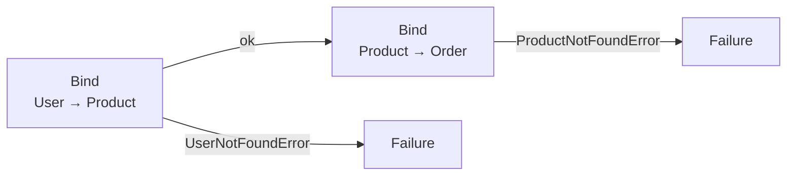

# REslava.Result v1.38.1

Bug fix + two IDE improvements: the `REslava.Result.Flow` chain walker now captures all pipeline steps reliably, both generator packages gain a `mermaid`-fenced "Insert diagram as comment" code action, and two new standalone samples ship.

---

## 🐛 Chain Walker Bug Fix — REslava.Result.Flow

`IInvocationOperation.Instance` traversal stopped after the first node for two common patterns:

- **Static roots** — `Result<T>.Ok(...)` (static call — `Instance` is null for static methods)
- **Async chains** — `*Async` extension methods on `Task<Result<T>>`

**Before:** 3 of 5 pipelines in `samples/result-flow` produced 1-node diagrams instead of the full chain.

**Fix:** replaced `Instance` traversal with a **syntax-walk + per-node `semanticModel.GetOperation()`** approach — reliably captures all steps regardless of calling convention.

```csharp
// All steps now captured correctly
[ResultFlow]
public static async Task<Result<UserDto>> PlaceOrderAsync(int userId, int productId, CancellationToken ct) =>
    await FindUser(userId)               // root — static method, was missed
        .BindAsync(u => FindProduct(productId, ct))  // async ext — was missed
        .EnsureAsync(p => p.Stock > 0, "Out of stock", ct)
        .MapAsync(p => new UserDto(p.Name), ct);
```

Three regression tests guard against recurrence:
- `ChainWalk_EnsureTriple_AllNodesPresent` — `Ensure×3` chain
- `ChainWalk_OkRootEnsureChain_OkPlusEnsureNodes` — `Result<T>.Ok(...)` root
- `ChainWalk_FourStep_AllNodesInOrder` — 5-step mixed chain

---

## 🧩 REslava.Result.Flow — REF002 Analyzer + Code Action

The REslava.Result-native package now emits the same REF002 "Insert diagram as comment" code action that `REslava.ResultFlow` has had since v1.36.0.

Full-fidelity output — includes both type travel **and** typed error edges:

```csharp
[ResultFlow]
public static Result<Order> PlaceOrder(int userId, int productId) =>
    FindUser(userId)
        .Bind(_ => FindProduct(productId))
        .Bind(p  => BuildOrder(userId, p));
```

Code action inserts (above the method, no build required):

```
/*

*/
```

---

## 🖼️ Mermaid Fence Format — Both Packages

Both `REslava.ResultFlow` and `REslava.Result.Flow` code actions now insert diagrams wrapped in a ` ```mermaid … ``` ` fence instead of a plain `/* ... */` comment.

The fence renders inline in VS Code, GitHub, Rider, and any Markdown-aware IDE — no copy-paste to mermaid.live needed.

---

## 📦 New Samples

### `samples/result-flow` — REslava.Result-native
5 pipelines demonstrating type travel + typed error edges:

| Pipeline | Demonstrates |
|----------|-------------|
| `ValidateOrder` | `Ok` seed + `Ensure×3` with typed errors |
| `PlaceOrder` | `Bind×2`, User → Product → Order type travel |
| `ProcessCheckout` | `Bind×2` + `Map`, full type travel + string conversion |
| `PlaceOrderAsync` | Async pipeline — ⚡ labels, typed errors |
| `AdminCheckout` | All node kinds, end-to-end type travel |

```bash
cd samples/result-flow && dotnet run
```

### `samples/resultflow-fluentresults` — Library-agnostic
3 pipelines using FluentResults + `REslava.ResultFlow` — **zero REslava.Result dependency**:

| Pipeline | Demonstrates |
|----------|-------------|
| `PlaceOrder` | `Bind×2`, User → Product → Order type travel |
| `ProcessCheckout` | `Bind×2` + `Map`, full type travel |
| `ValidateAndPlace` | Inline guards via `Bind` (stock check + price limit) |

```bash
cd samples/resultflow-fluentresults && dotnet run
```

---

## 📦 NuGet

| Package | Link |
|---------|------|
| REslava.Result | [View on NuGet](https://www.nuget.org/packages/REslava.Result/1.38.1) |
| REslava.Result.AspNetCore | [View on NuGet](https://www.nuget.org/packages/REslava.Result.AspNetCore/1.38.1) |
| REslava.Result.Analyzers | [View on NuGet](https://www.nuget.org/packages/REslava.Result.Analyzers/1.38.1) |
| REslava.Result.FluentValidation | [View on NuGet](https://www.nuget.org/packages/REslava.Result.FluentValidation/1.38.1) |
| REslava.Result.Http | [View on NuGet](https://www.nuget.org/packages/REslava.Result.Http/1.38.1) |
| REslava.ResultFlow | [View on NuGet](https://www.nuget.org/packages/REslava.ResultFlow/1.38.1) |
| REslava.Result.Flow | [View on NuGet](https://www.nuget.org/packages/REslava.Result.Flow/1.38.1) |

---

## Stats

- 3,986 tests passing across net8.0, net9.0, net10.0 (1,216×3) + generator AspNetCore (131) + Result.Flow (22) + ResultFlow (40) + analyzer (79) + FluentValidation bridge (26) + Http (20×3)
- 142 features across 13 categories
