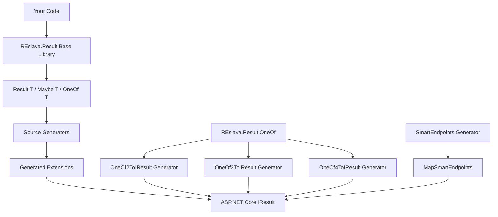

**REslava.Result is a comprehensive ecosystem with two main components that work together seamlessly:**

### 📦 Base Library: REslava.Result
**Core Functional Programming Foundation**
```
src/
├── Result.cs                      # 🎯 Core Result<T> implementation
├── Result.NonGeneric.cs           # 📄 Non-generic Result for void operations
├── AdvancedPatterns/
│   ├── Maybe.cs                   # 🎲 Safe null handling
│   ├── OneOf.cs                   # 🔀 Discriminated unions (2, 3, 4+ types)
│   ├── OneOfResultExtensions.cs   # � OneOf ↔ Result conversions
│   └── Validation/
│       ├── Validator.cs           # ✅ Validation framework
│       ├── IValidationRule.cs     # 📋 Validation rule interface
│       └── ValidationResult.cs    # 📊 Validation results
├── Extensions/
│   ├── ResultExtensions.cs        # 🔗 LINQ and async extensions
│   ├── ResultMapExtensions.cs     # 🗺️ Mapping and transformation
│   └── ResultFunctionalExtensions.cs # 🧠 Functional composition
└── Utilities/
    ├── Compose.cs                 # 🔄 Function composition utilities
    └── Error.cs                   # ❌ Error base classes
```

### 🚀 Source Generators: REslava.Result.SourceGenerators
**Zero-Boilerplate Code Generation**
```
SourceGenerator/
├── Core/                           # 📐 Generator Infrastructure
│   ├── CodeGeneration/            # 📝 CodeBuilder utilities
│   ├── Utilities/                 # 🌐 HttpStatusCodeMapper, AttributeParser
│   ├── Configuration/             # ⚙️ Configuration base classes
│   └── Interfaces/                # � SOLID interfaces
├── Generators/                     # 📦 Individual Generators
│   ├── ResultToIResult/          # 🎯 Result → Minimal API IResult conversion
│   │   ├── Attributes/            # 🏷️ Auto-generated attributes
│   │   ├── CodeGeneration/        # 💻 Extension method generation
│   │   └── Orchestration/         # 🎼 Pipeline coordination
│   ├── ResultToActionResult/      # 🎯 Result → MVC IActionResult conversion (v1.21.0)
│   │   ├── Attributes/            # 🏷️ Auto-generated attributes
│   │   ├── CodeGeneration/        # 💻 Extension method generation
│   │   └── Orchestration/         # 🎼 Pipeline coordination
│   ├── OneOfToIResult/            # 🚀 OneOf<T1,...,TN> → HTTP (consolidated v1.14.1)
│   │   ├── OneOf2ToIResultGenerator.cs  # 🎯 Thin wrapper (arity=2)
│   │   ├── OneOf3ToIResultGenerator.cs  # 🎯 Thin wrapper (arity=3)
│   │   ├── OneOf4ToIResultGenerator.cs  # 🎯 Thin wrapper (arity=4)
│   │   ├── Attributes/            # 🏷️ Shared attribute generators
│   │   ├── CodeGeneration/        # 💻 Arity-parameterized extensions
│   │   └── Orchestration/         # 🎼 Single shared orchestrator
│   ├── OneOfToActionResult/       # 🎯 OneOf<T1,...,TN> → MVC IActionResult (v1.22.0)
│   │   ├── OneOf2ToActionResultGenerator.cs  # 🎯 Thin wrapper (arity=2)
│   │   ├── OneOf3ToActionResultGenerator.cs  # 🎯 Thin wrapper (arity=3)
│   │   ├── OneOf4ToActionResultGenerator.cs  # 🎯 Thin wrapper (arity=4)
│   │   ├── Attributes/            # 🏷️ Shared attribute generators
│   │   ├── CodeGeneration/        # 💻 Arity-parameterized extensions
│   │   └── Orchestration/         # 🎼 Single shared orchestrator
│   └── SmartEndpoints/            # ⚡ Auto-generate Minimal APIs (v1.11.0+)
│       ├── Attributes/            # 🏷️ AutoGenerateEndpoints attribute
│       ├── CodeGeneration/        # 💻 SmartEndpointExtensionGenerator
│       ├── Models/                # 📋 EndpointMetadata
│       └── Orchestration/         # 🎼 SmartEndpointsOrchestrator
└── Tests/                         # 🧪 Comprehensive Test Suite (1,976+ tests)
    ├── OneOfToIResult/           # ✅ 12/12 tests (unified, covers arity 2/3/4)
    ├── OneOfToActionResult/      # ✅ 12/12 tests passing (NEW v1.22.0!)
    ├── SmartEndpoints/           # ✅ 4/4 tests passing
    ├── ResultToIResult/          # ✅ 6/6 tests passing
    ├── ResultToActionResult/     # ✅ 9/9 tests passing (NEW v1.21.0!)
    ├── CoreLibrary/              # 📚 Base library tests
    └── GeneratorTest/             # � Integration tests
```

> 📐 **Visual Architecture**: See [Core Type Hierarchy](https://github.com/reslava/nuget-package-reslava-result/blob/main/docs/uml/UML-v1.12.1-core.md) and [Source Generator Pipeline](https://github.com/reslava/nuget-package-reslava-result/blob/main/docs/uml/UML-v1.12.1-generators.md) for detailed Mermaid diagrams.

### 🎯 SOLID Principles in Action

| **Principle** | **Implementation** | **Benefit** |
|---------------|-------------------|-------------|
| **Single Responsibility** | Separate classes for attributes, code generation, orchestration | Zero duplicate generation, clear concerns |
| **Open/Closed** | Interface-based design (IAttributeGenerator, ICodeGenerator, IOrchestrator) | Easy to add new generators without modifying existing code |
| **Liskov Substitution** | All generators implement common interfaces | Interchangeable components, consistent behavior |
| **Interface Segregation** | Focused interfaces for specific responsibilities | Minimal contracts, easier testing |
| **Dependency Inversion** | Constructor injection with abstractions | Testable, maintainable, loosely coupled |

### 🔄 How Components Work Together



### 🚀 Smart Auto-Detection (v1.10.0)
**Zero Configuration Required**
- **Setup Detection**: Automatically detects your REslava.Result OneOf setup
- **Conflict Prevention**: Generators only run when appropriate types are found
- **Perfect Coexistence**: OneOf generators work seamlessly together
- **Zero Compilation Errors**: Clean developer experience guaranteed

---